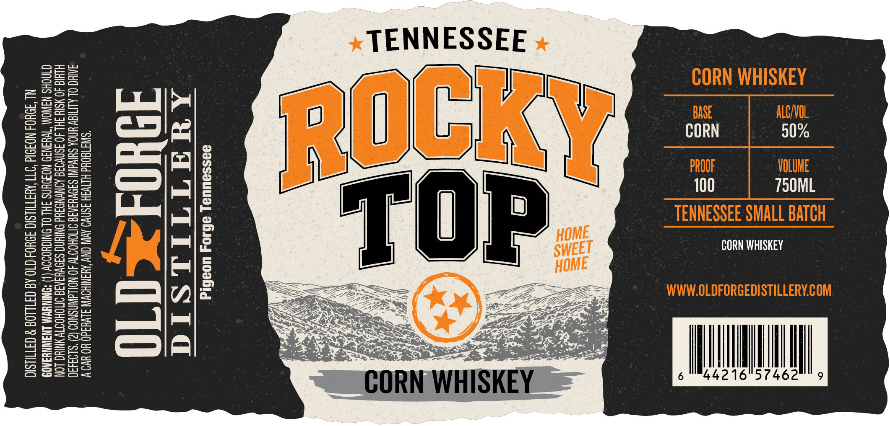

# TTB COLA Label Images - TTBID 26161001000153

**Brand Name:** ROCKY TOP

**Issue Date:** 06/17/2026

**Origin Code:** 43

**Product Class/Type:** 143

**Source:** [TTB Public COLA Registry](https://ttbonline.gov/colasonline/viewColaDetails.do?action=publicFormDisplay&ttbid=26161001000153)

## Label Images

### Front Label

### Label 2

## Extracted Label Text

*Text extracted via OCR - may contain errors*

*1 image(s) excluded: text did not meet readability threshold*

### Front Label

o=yw
Sra
=
=e
wHeS *TEN
2555 SS
a =
Sans E E
Sess es *
= Sara
a 8228
gseee 2
= ESe5 eal
= RaeSo5 M4 ONDN I
= we Siu fy CORN WHISKE
SEEaS = ari LEN Wrilor mY,
2stss = — IONE}
afese o Dacre T ES
BEZeSs ‘T ial = DAOL | ia
ES ease bie se Sette
Ss es = & eee | 0
seus: “Y* mal RN | 50%
[==] Swi ZS % \, TRIE eee
a gsuc= / . i PROOF | —
aq gses al of | UE
= eSs= | 3 0 | VOLUME
SSzS2e Alz 2 — 750M
Besse } ee HOME TENNESSEE CMA ML
aes jm LE PIII j _ TENNESSEE SMALL
ae  ] <i Bee f ae NESSEE SMALL BAT Ti
& CRS SEF FEES | L OMALL DALI
2SSee fea SSO Zu Nee ME CORN Sawer
HS SST RRs. pete WHISK
2 Eee Sa, PRR LZ Leen Ca WWW.OLDFORE
— Sei ee De Core Sob icae LOLDFORGEDISTILLER
we a p — DPSS RE JISTILLERY.COM
clement, ¥ i Lt VAT Pe See ES ~~ By oi
_ vu i N WH aury ed Seed
x WHITORE -@ss
ae 6 442 Hil
462
9
