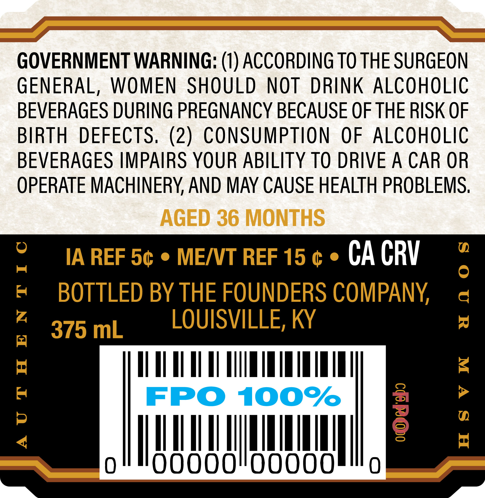
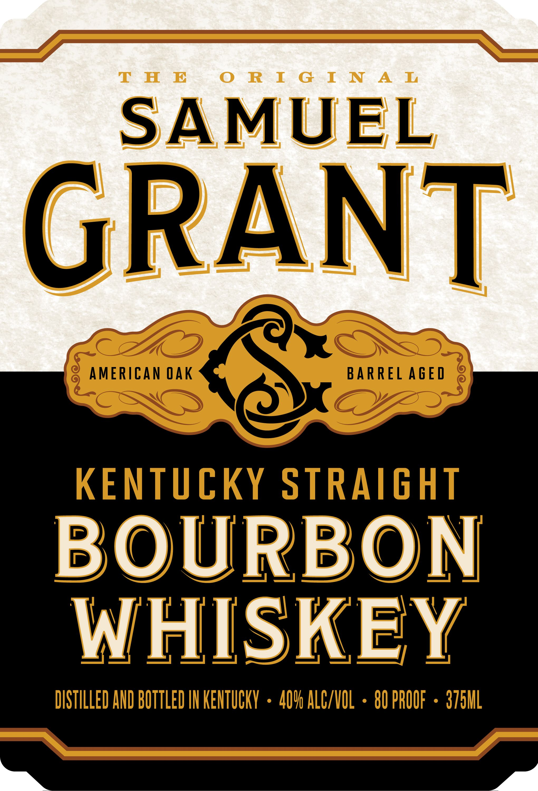

# TTB COLA Label Images - TTBID 26161001000157

**Brand Name:** SAMUEL GRANT

**Issue Date:** 06/16/2026

**Origin Code:** 22

**Product Class/Type:** 101

**Source:** [TTB Public COLA Registry](https://ttbonline.gov/colasonline/viewColaDetails.do?action=publicFormDisplay&ttbid=26161001000157)

## Label Images

### Back Label

### Front Label

## Extracted Label Text

*Text extracted via OCR - may contain errors*

**Detected Proof:** 80

### Back Label

GOVERNMENT WARNING: (1) ACCORDING TO THE SURGEON
GENERAL,
WOMEN
SHOULD
NOT
DRINK
ALCOHOLIC
BEVERAGES DURING PREGNANCY BECAUSE OF THE RISK OF
BIRTH
DEFECTS. (2)
CONSUMPTION
OF
ALCOHOLIC
BEVERAGES IMPAIRS YOUR ABILITY TO DRIVE A CAR OR
OPERATE MACHINERY AND MAY CAUSE HEALTH PROBLEMS;
AGED 36 MONTHS
IA REF 5c
MEIVT REF 15
CA CRV
BOTTLED BY THE FOUNDERS COMPANY
d
375 mL
LOUISVILLE; KY
4

FPO
100%
8
;
0
Oooooioooo0
0

### Front Label

T H E
R I
G I N
A I
SAMUEL
GRANT
O
AMERICAN Qak
BARREL AGED
KENTUCKY
STRAIGHT
BOURBON
WHISKEY
DISTILLED AND BOTTLED IH KEHTUCKY
40V6 ALC/VOL
80 PROOF
3751L
