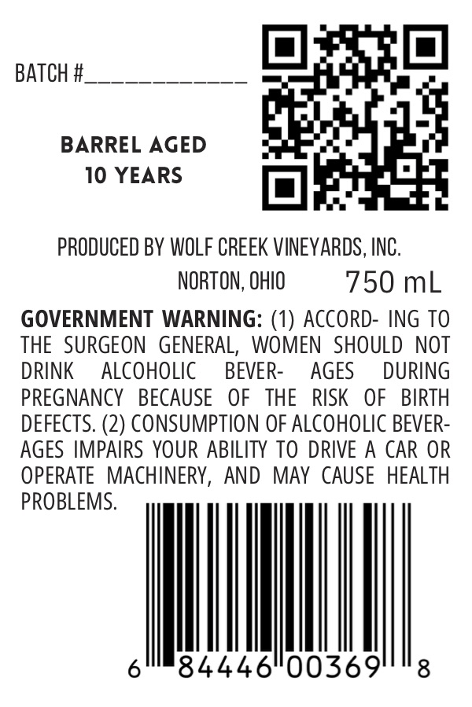
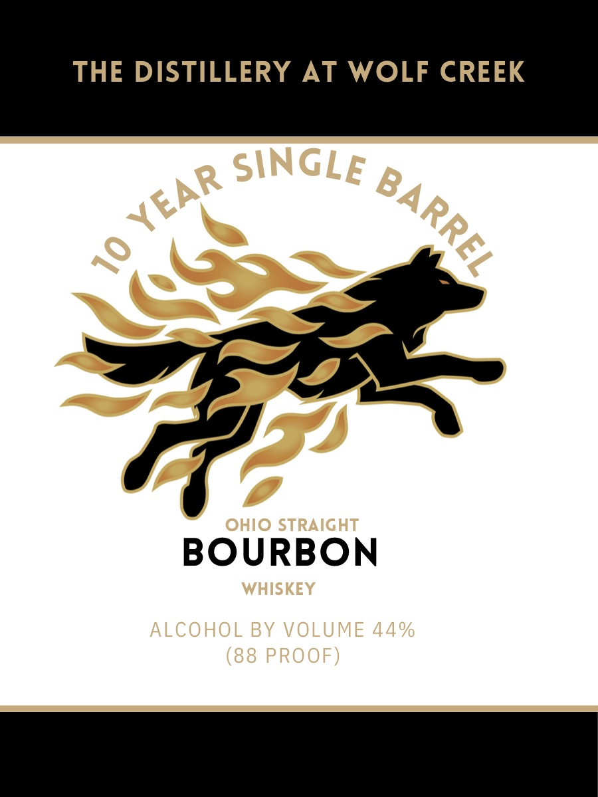

# TTB COLA Label Images - TTBID 26161001000158

**Brand Name:** THE DISTILLERY AT WOLF CREEK

**Issue Date:** 06/16/2026

**Origin Code:** 09

**Product Class/Type:** 101

**Source:** [TTB Public COLA Registry](https://ttbonline.gov/colasonline/viewColaDetails.do?action=publicFormDisplay&ttbid=26161001000158)

## Label Images

### Back Label

### Label 1

## Extracted Label Text

*Text extracted via OCR - may contain errors*

**Detected Proof:** 88
**Detected Age:** 10 Years

### Back Label

BATCH #

ee

Obey O|

BARREL AGED

is

aes

10 YEARS

wOa

PRODUCED BY WOLF CREEK VINEYARDS, INC

NORTON, OHIO

750 mL

GOVERNMENT WARNING: (1) ACCORD- ING TO

THE SURGEON GENERAL, WOMEN SHOULD NOT

DRINK ALCOHOLIC

BEVER

AGES

DURING

PREGNANCY BECAUSE OF THE RISK OF BIRTH

DEFECTS. (2) CONSUMPTION OF ALCOHOLIC BEVER

AGES IMPAIRS YOUR ABILITY TO DRIVE A CAR OR

OPERATE MACHINERY, AND MAY CAUSE HEALTH

|

9

### Label 1

THE DISTILLERY AT WOLF CREEK
SINGLE
4
OHIO STRAIGHT
BOURBON
WHISKEY
ALCOHOL BY VOLUME 44%
(88 PROOF)
YEAR
BARREL
