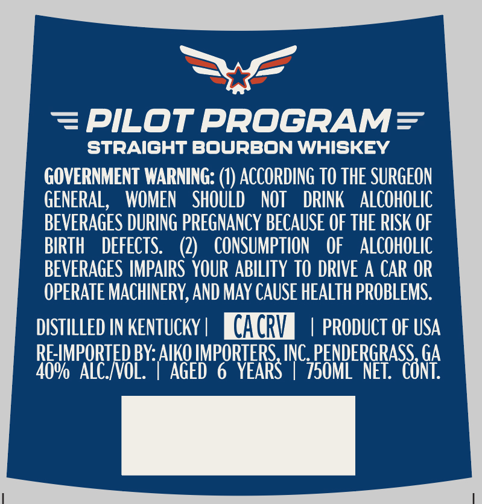

# TTB COLA Label Images - TTBID 26161001000330

**Brand Name:** PILOT PROGRAM

**Issue Date:** 06/16/2026

**Origin Code:** 08

**Product Class/Type:** 101

**Source:** [TTB Public COLA Registry](https://ttbonline.gov/colasonline/viewColaDetails.do?action=publicFormDisplay&ttbid=26161001000330)

## Label Images

### Front Label

## Extracted Label Text

*Text extracted via OCR - may contain errors*

**Detected Proof:** 80
**Detected Age:** 6 Years

### Front Label

PILOT PROGRAM=
STRAIGHT BOURBON WHISKEY
GOVERNMENT WARNING: (1) ACCORDING TO THE SURGEON
GENERAL,
WOMEN
shouLD
NOT
DRINK
ALCOHOLIC
BEVERAGES DURING PREGNANCY BECAUSE OF THE RISK OF
BIRTH
DEFECTS:
(2)
CONSUMPTION
OF
aLCOHOLIC
BEVERAGES IMPAIRS  YOUR ABILITY TO DRIVE A CAR OR
OPERATE MACHINERY,AND MAY CAUSe HEALTH PROBLEMS:
DISTILLED IN KENTUCKY
CACRV
PRODUCT OF USA
RE-IMPORTED BY: AIKO IMPORTERS, INC. PENDERGRASS GA
40%   ALC_IVOL:
AGeD"
6 YEARS
'750ML  NET:  CONT:
