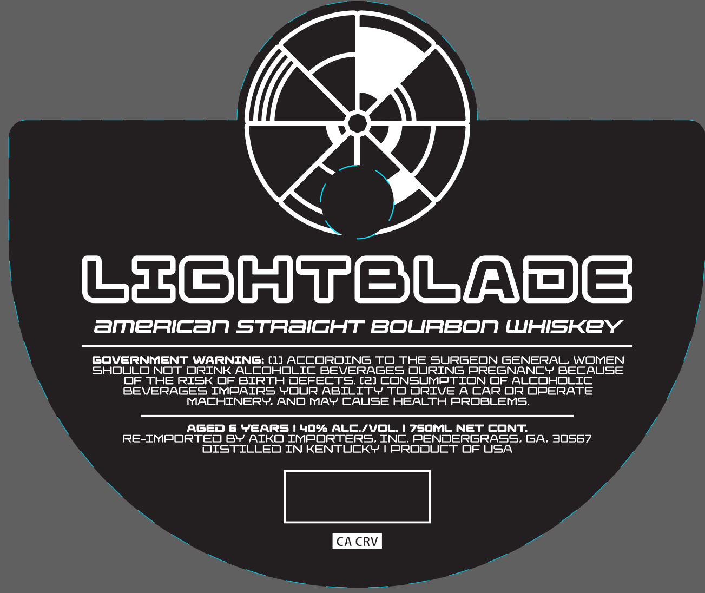

# TTB COLA Label Images - TTBID 26161001000332

**Brand Name:** LIGHTBLADE

**Issue Date:** 06/16/2026

**Origin Code:** 08

**Product Class/Type:** 101

**Source:** [TTB Public COLA Registry](https://ttbonline.gov/colasonline/viewColaDetails.do?action=publicFormDisplay&ttbid=26161001000332)

## Label Images

### Front Label

## Extracted Label Text

*Text extracted via OCR - may contain errors*

**Detected Age:** 6 Years

### Front Label

LoGHTBGQDB
aMERICAN STRZICHT BOURBON WHISKEY
GOVERNMENT WARNING: [1) ACCOROING TD THE SURGEON GENERAL_
WOJMEN
SHOULONOT ORINK ALCOHDLIC BEVERAGES DURING PREGNANCY BECAUSE
DF THE RISK DF BIRTH OEFECTS; [Z) CONSUMPTIDN OF ALCOHDLIC
BEVERAGES IMPAIRS YOUR ABILITYTO DRIVE ACAROR DPERATE
MACHINERY ANOMAYCAUSE HEALTH PROBLEMS;
AGED 6 YEARS ! 409 ALC/VOL
7SOML NET CONT
RE-IMPORTED BY AIKO IMPORTERS. INC, PENDERGRASS.GA_
3OS67
OISTILLEO IN KENTUCKY
PRODUCT OF USA
CA CRV
