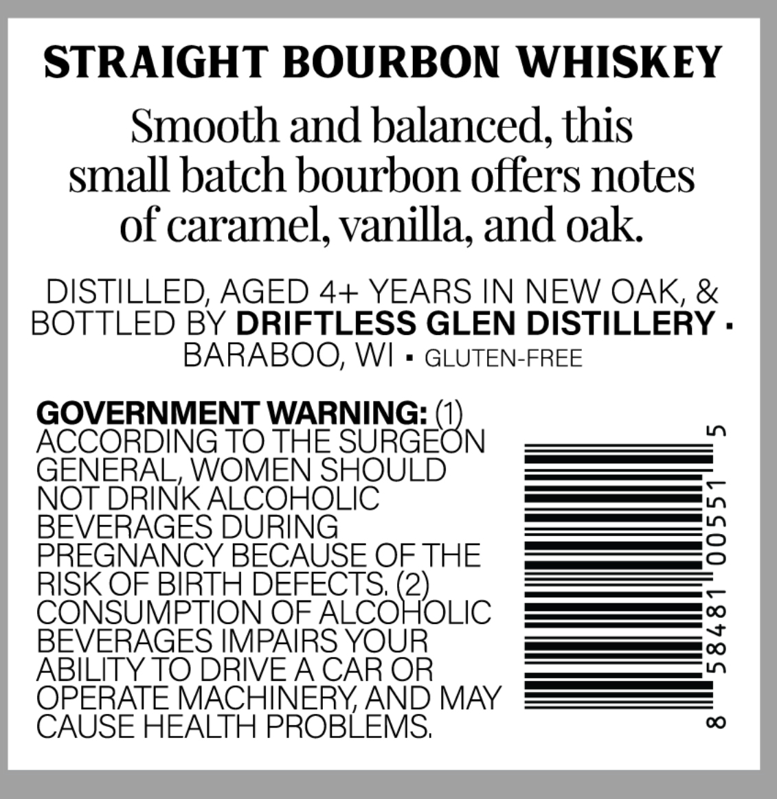
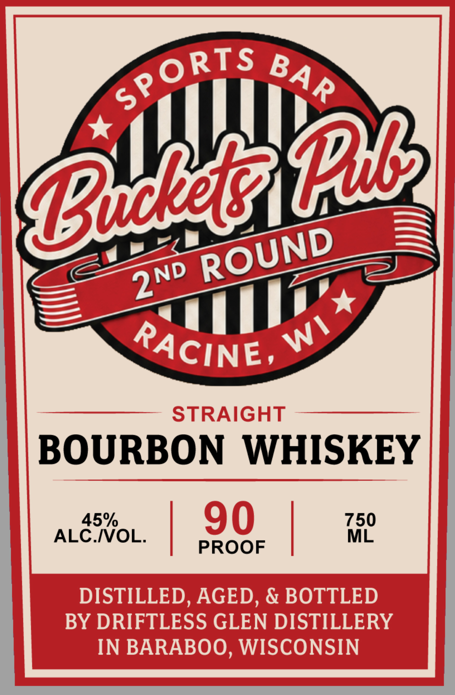

# TTB COLA Label Images - TTBID 26161001000359

**Brand Name:** BUCKETS PUB 2ND ROUND

**Issue Date:** 06/16/2026

**Origin Code:** 48

**Product Class/Type:** 101

**Source:** [TTB Public COLA Registry](https://ttbonline.gov/colasonline/viewColaDetails.do?action=publicFormDisplay&ttbid=26161001000359)

## Label Images

### Back Label

### Front Label

## Extracted Label Text

*Text extracted via OCR - may contain errors*

**Detected Proof:** 90

### Back Label

STRAIGHT BOURBON WHISKEY
Smooth and balanced; this
small batch bourbon offers notes
of caramel, vanilla; and oak
DISTILLED, AGED 4+ YEARS IN NEW OAK, &
BOTTLED BY DRIFTLESS GLEN DISTILLERY .
BARABOO, WI
GLUTEN-FREE
GOVERNMENT WARNING: (1)
LO
ACCORDING TO THE SURGEON
GENERAL, WOMEN SHOULD
NOT DRINK ALCOHOLIC
BEVERAGES DURING
3
PREGNANCY BECAUSE OF THE
RISK OF BIRTH DEFECTS;
CONSUMPTION OF
TO&Lic
BEVERAGES IMPAIRS YOUR
;
ABILITY TO DRIVEA CAR OR
OPERATE MACHINERY AND MAY
CAUSE HEALTH PROBLEMS;
00

### Front Label

STRAIGHT
BOURBON
WHISKEY
45%
90
750
ALC.IVOL.
ML
PROOF
DISTILLED, AGED, & BOTTLED
BY DRIFTLESS GLEN DISTILLERY
IN BARABOO, WISCONSIN
SPORTS
BA R
{b
B@iRBi
ROUND
2ND
WI
RACINE,
