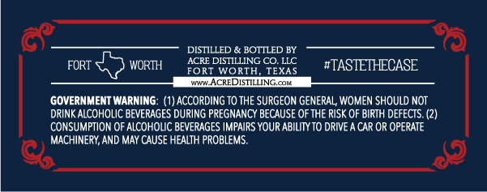
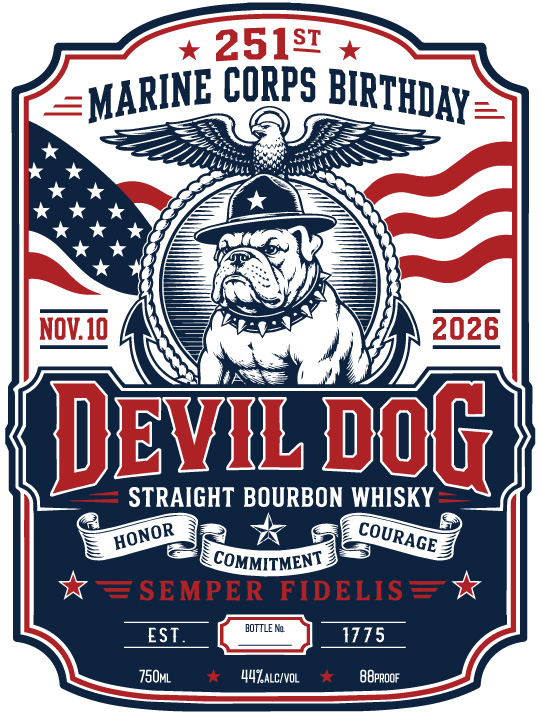

# TTB COLA Label Images - TTBID 26161001000378

**Brand Name:** DEVIL DOG STRAIGHT BOURBON WHISKY

**Issue Date:** 06/16/2026

**Origin Code:** 44

**Product Class/Type:** 101

**Source:** [TTB Public COLA Registry](https://ttbonline.gov/colasonline/viewColaDetails.do?action=publicFormDisplay&ttbid=26161001000378)

## Label Images

### Back Label

### Front Label

## Extracted Label Text

*Text extracted via OCR - may contain errors*

### Back Label

DISTILLED
BOTTLED BY
FORT
WORTH
ACRE DISTILLING cO LLC
#TASTETHECASE
FORT
Io
RTH
TEXAS
Kw ACREDISTILNG.CoK
GOVERNMENT WARNING
ACCORDING TO THE SURGEON GENERAL WOMEN SHOULD NOT
DRINK ALCOHOLIC BEVERAGES DURING PREGNANCY BECAUSE OF THE RISK OF BIRTH DEFECTS
CONSUMPTION OF ALCOHOLIC BEVERAGES IMPAIRS YOUR ABILITY TO DRIVE A CAR OR OPERATE
MACHINERY, AND MAY CAUSE HEALTH PROBLEMS.

### Front Label

25151
CORPS
NOV 10
2026
JEVL @OG_
STRAIGHT BOURBON WHISKY
COMMITMENT
SEMPER FIDELIS
DOTTLE M
EST
1775
750ml
44Zalcivol
ABppogF
BIRTHDAY
MARINE
~COURAGE
HONOR
