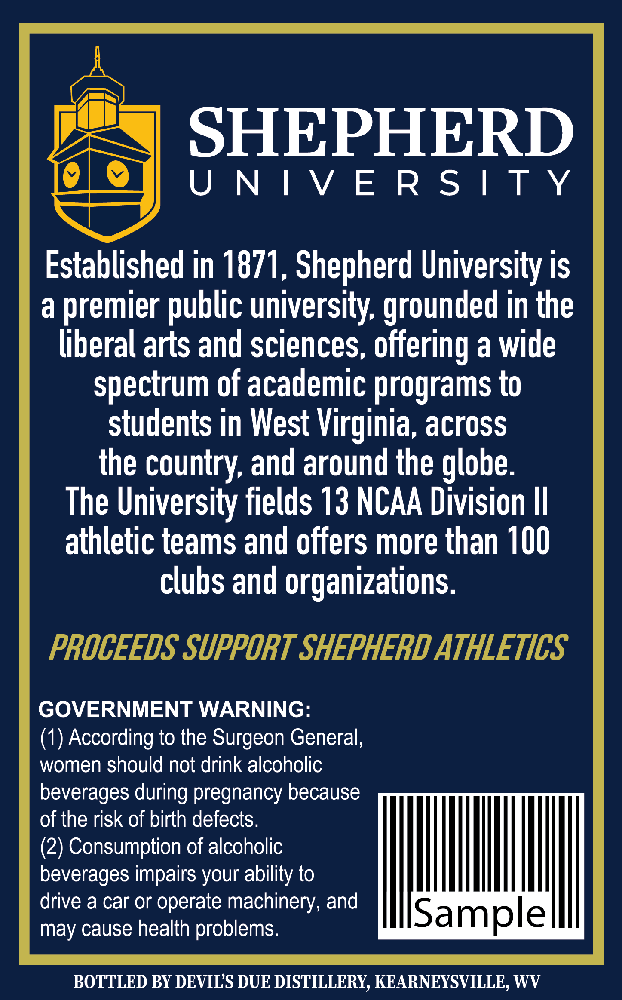
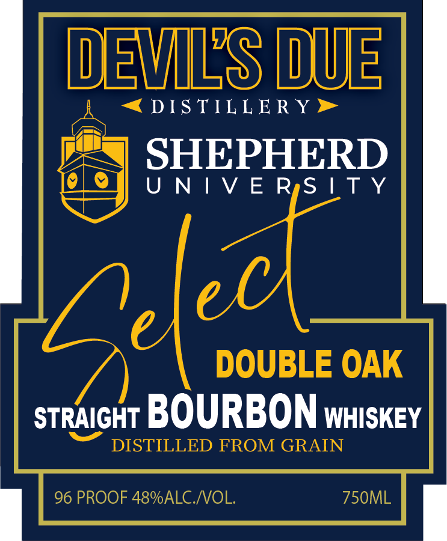

# TTB COLA Label Images - TTBID 26161001000465

**Brand Name:** DEVIL'S DUE DISTILLERY

**Fanciful Name:** SHEPHERD UNIVERSITY SELECT

**Issue Date:** 06/18/2026

**Origin Code:** 47

**Product Class/Type:** 101

**Source:** [TTB Public COLA Registry](https://ttbonline.gov/colasonline/viewColaDetails.do?action=publicFormDisplay&ttbid=26161001000465)

## Label Images

### Back Label

### Label 1

### Label 2

## Extracted Label Text

*Text extracted via OCR - may contain errors*

*1 image(s) excluded: text did not meet readability threshold*

**Detected Proof:** 96

### Back Label

“J SHEPHERD

dic UNIVERSITY

Established in 1871, Shepherd University is

a premier public university, grounded in the

liberal arts and sciences, offering a wide

spectrum of academic programs to

students in West Virginia, across

the country, and around the globe

The University fields 13 NCAA Division II

athletic teams and offers more than 100

clubs and organizations

PROCEEDS SUPPORT SHEPHERD ATHLETICS

GOVERNMENT WARNING

(1) According to the Surgeon General

women should not drink alcoholic

beverages during pregnancy because

of the risk of birth defects

(2) Consumption of alcoholic

beverages impairs your ability to

|

il

drive a car or operate machinery, and

may cause health problems

Sample

|

BOTTLED BY DEVIL'S DUE DISTILLERY, KEARNEYSVILLE, WV

### Label 1

DEVLS DUE
DTS TILLERY
SHEPHERD
U N | V E RiS | T y
DOUBLE OAK
STRAIGHT BOURBON WHISKEY
DISTILLED FROM GRAIN
96 PROOF 48%ALCNOL:
750ML
2ld
