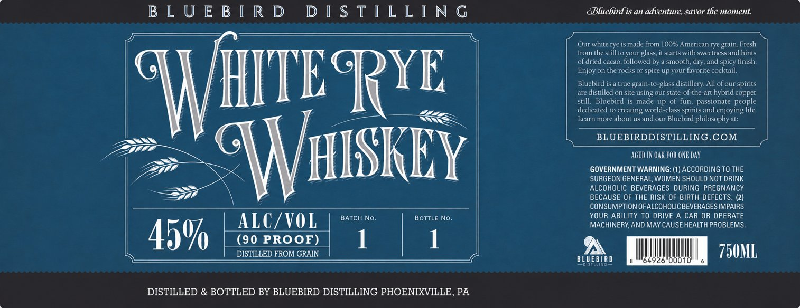

# TTB COLA Label Images - TTBID 26161001000470

**Brand Name:** BLUEBIRD DISTILLING

**Fanciful Name:** WHITE RYE WHISKEY

**Issue Date:** 06/16/2026

**Origin Code:** 39

**Product Class/Type:** 142

**Source:** [TTB Public COLA Registry](https://ttbonline.gov/colasonline/viewColaDetails.do?action=publicFormDisplay&ttbid=26161001000470)

## Label Images

### Label 1

## Extracted Label Text

*Text extracted via OCR - may contain errors*

**Detected Proof:** 90

### Label 1

B L U E B [ R D
D [ $ T [ L L [ N G
OBluebird is an adventure, savor the moment.
Our white rye is made from 100% American rye grain Fresh
from the still to your glass,it starts
sweetness and hints
of dried cacao, lollowed by
smooth
and spicy linish.
Enjoy on the rocks or spice Upyour favorite cocktail.
RYE
Bluebird i5
true grain-to-glass distillery All of our spirits
are distilled on site using our state-of-the-art hybrid copper
Bluebird is made
up of
passionate people
dedicated t0 creating world-class spirits and enjoying life
Learn more about us and our Bluebird philosophyat;
BLUEBIRDDISTILLING COM
WHISkEy |
AGED IN Oak FOR ONE Day
GOVERNMENT WARNING: (1) ACCORDING TO THE
SURGEON GENERAL,WOMEN SHOULD NOT DRINK
ALCOHOLIC BEVERAGES DURING PREGNANCY
BECAUSE OF THE RISK OF BIRTH DEFECTS. (21
CONSUMPTION OFALCOHOLICBEVERAGESIMPAIRS
BATCH No_
BOTTLE No
YOUR ABILITY TO DRIVE A CAR OR OPERATE
ALC/VOL
MACHINERY,AND MAY CAUSE HEALTH PROBLEMS
450
(90 PROOF)
1
DISTILLED FROM GRAIN
750ML
BLUE BIR D
64926" 00o10'
DISTILLED & BOTTLED BY BLUEBIRD DISTILLING PHOENIXVILLE, PA
WHITE-
With
dry;
still
fun;
