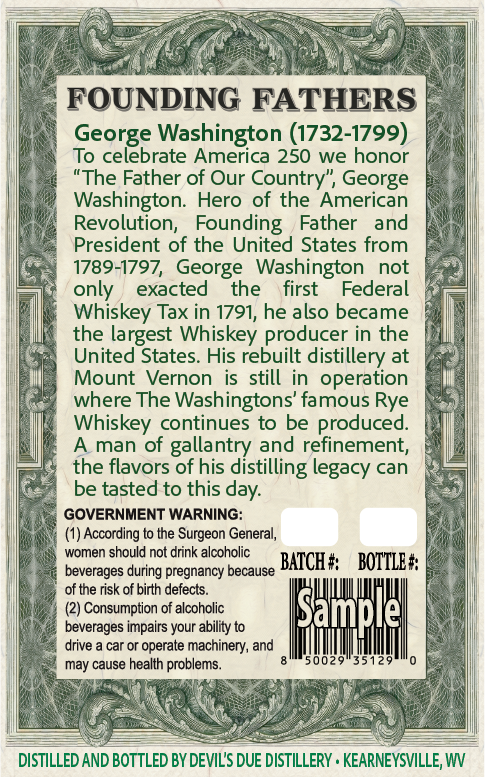
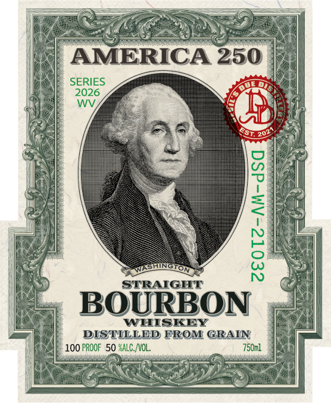

# TTB COLA Label Images - TTBID 26161001000505

**Brand Name:** DEVIL'S DUE DISTILLERY

**Fanciful Name:** AMERICA 250 WASHINGTON

**Issue Date:** 06/22/2026

**Origin Code:** 47

**Product Class/Type:** 111

**Source:** [TTB Public COLA Registry](https://ttbonline.gov/colasonline/viewColaDetails.do?action=publicFormDisplay&ttbid=26161001000505)

## Label Images

### Back Label

### Front Label

### Label 3

## Extracted Label Text

*Text extracted via OCR - may contain errors*

*1 image(s) excluded: text did not meet readability threshold*

### Back Label

FOUNDING FATHERS
George Washington (1732-1799)
To celebrate America 250 we honor
"The Father of Our Country", George
Washington: Hero of the American
Revolution;   Founding
Father
and
President of the United States from
1789-1797, George   Washington
not
only
exacted
the
first
Federal
Whiskey Tax in 1791, he also became
the largest Whiskey producer in the
United States. His rebuilt distillery at
Mount Vernon
is still in operation
where The Washingtons' famous Rye
Whiskey continues to be produced_
A man of
and refinement
the flavors
sollais tastilliag
of his
legacy can
be tasted to this
GOVERNMENT WARNING:
(1) According to the
General;
women should not drink alcoholic
beverages during pregnancy because
BATCH #
BOTTLE #
of the risk of birth defects.
(2) Consumption of alcoholic
Sample
beverages impairs your ability to
drive
car or operate machinery, and
may cause health problems_
50029
35129
DISTILLED AND BOTTLED BY DEVIL'S DUE DISTILLERY . KEARNEYSVILLE; W
day:
Surgeon

### Label 3

sos

a:

cms /,

I$

Well one

BOTTLED IN BOND

aivd ASTOXG TWIG

ET TE NRE

CL

UN A

FER UMENIES

IN ae LE

AES

202%
