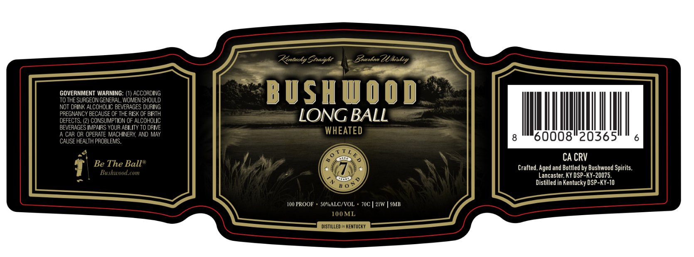

# TTB COLA Label Images - TTBID 26161001000506

**Brand Name:** BUSHWOOD

**Issue Date:** 06/16/2026

**Origin Code:** 22

**Product Class/Type:** 111

**Source:** [TTB Public COLA Registry](https://ttbonline.gov/colasonline/viewColaDetails.do?action=publicFormDisplay&ttbid=26161001000506)

## Label Images

### Label 1

## Extracted Label Text

*Text extracted via OCR - may contain errors*

### Label 1

Renttcky Eoaight
Eouxdon ZUhiskcy
GOVERNMENT WARNING:
ACCORDING
B USHWOOD
TO THE SURGEON GENERAL, WOMEN SHOULD
NOT DRINK AL COHOLIC BEVERAGES DURING
PREGNANCY BECAUSE OF THE RISK OF BIRTH
LONG BALL
DEFECTS. (2) CONSUMPTION OF ALCOHOLIC
BEVERAGES IMPAIRS YOUR ABILITY TO DRIVE
WHEATED
CAR OR OPERATE MACHINERY, AND MAY
60008"20365
CAUSE HEALTH PROBLEMS.
CA CRV
Be The Balle
Crafted. Aged and Bottled by Bushwood Spirits.
Bushivood.com
Lancaster; KY DSP-KY-20075_
Distilled in Kentucky DSP-KY-10
I00 PROOF
50"ALC/VOL
70C
21W
9MB
10OML
DISTILLED I KENTUCKY
