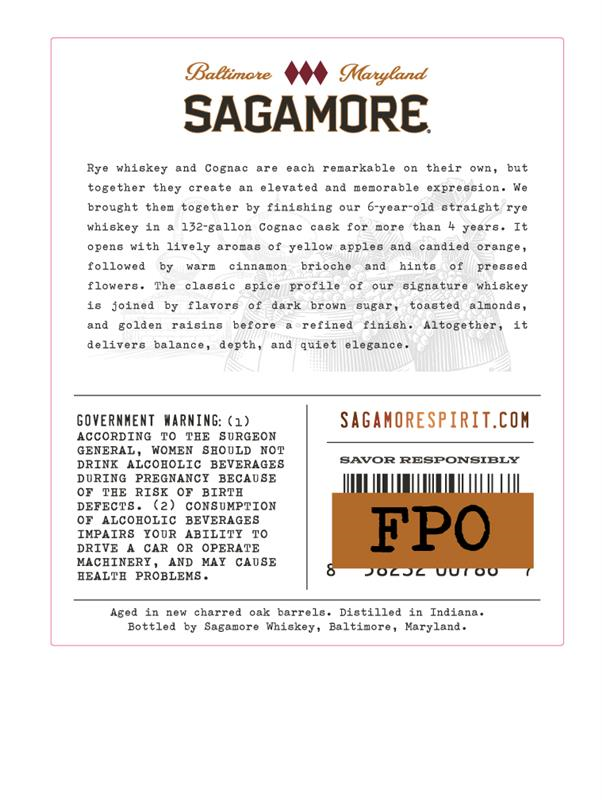
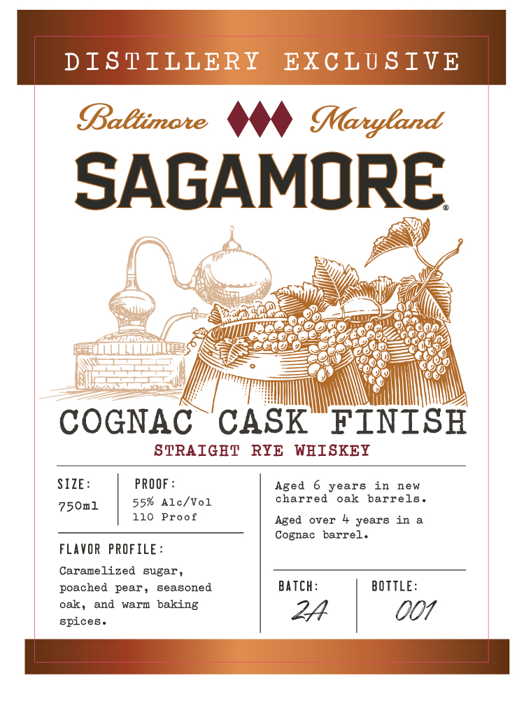

# TTB COLA Label Images - TTBID 26161001000517

**Brand Name:** SAGAMORE

**Fanciful Name:** COGNAC CASK FINISH

**Issue Date:** 06/16/2026

**Origin Code:** 25

**Product Class/Type:** 102

**Source:** [TTB Public COLA Registry](https://ttbonline.gov/colasonline/viewColaDetails.do?action=publicFormDisplay&ttbid=26161001000517)

## Label Images

### Back Label

### Front Label

## Extracted Label Text

*Text extracted via OCR - may contain errors*

**Detected Proof:** 110

### Back Label

Baltimate
Maryland
SAGAMORE
Rye whiskey and Cognac
are
each
reearkable
their
own,
but
L0f0
ther they
create
elevated ind
nedorable
expregsion .
brought
them
togcther by finishing our 6-yoar-old otraight rye
whiskey 10
152-gall0n
Cognac
cabx
For
Do5e
than
years
opens with lively
Jrofit
yellow
aPpleg
anid
candied
orange
followed
Karm
cinnamor
brloche
and
hinto
Preseed
flowere
Th e
claesic
spice profile
our
6ignture
whiskey
18 joined
flavore
aark
broWn
Bug5
toaeted
alzonde
and
golden
raisino
befor
refined
finieh
Altogether
delivers
balance ,
depth,
nnd
quiet
a51n €
GOveRnMEnT MARMING: (1)
SaganORespiRIT.cOM
ACCORDING
TAE
SuRGEON
GENERAL
WOKEN
8EOULD
NOT
DRINK ALCOBOLIC
BEVERAGES
SAVOR RESPONSIELY
DURING  PREGNANCI BECAUSE
TBE
RIS
BIRTA
DEFECT8
CONSUMPTION
ALCOBOLIC
BEVERAGES
IMPAIRS
IOOR
ABILITI
FPO
DRIVE
CAR
OR
OPERATE
MACHINERY
AND
HAY
CAUSE
HEALTB
PROBLEMS
JOcj
U0T00
Aged in
new
charred oak
barrelo. Distilled in
Indiana .
Bottled
Sagamore
Whiskey ,
Baltinore
Karyland

### Front Label

DISPILLERY
EXCLU SIVE
Baltimate
Maryland
SAGAMORE
COGNAC
CASK
FINISH
STRAIGET
RYE
WHISKEY
SIZE:
PROOF
Aged
years
in
new
750n1
55%
Alc/Vol
charred
oak
barrels
110
Proof
Aged
over
years
in
Cognac
barrel.
FLAVOR
PROFILE:
Caramelized
sugar
poached
pear
seasoned
Batch:
BOTTLE:
oak,
and
warm
baking
24
001
spices .
