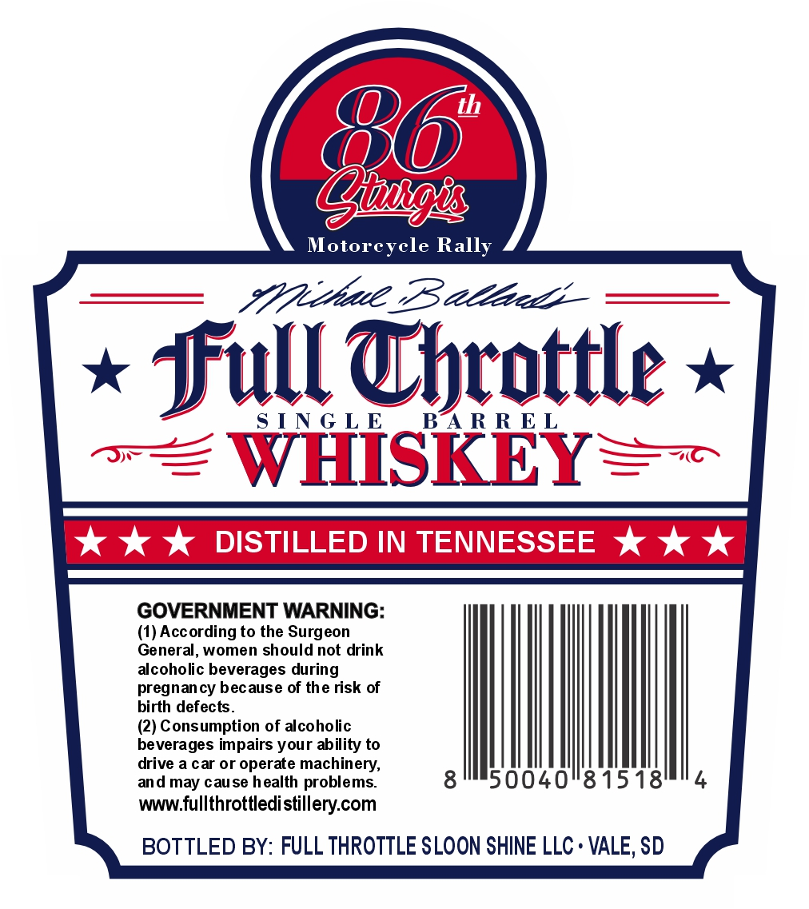
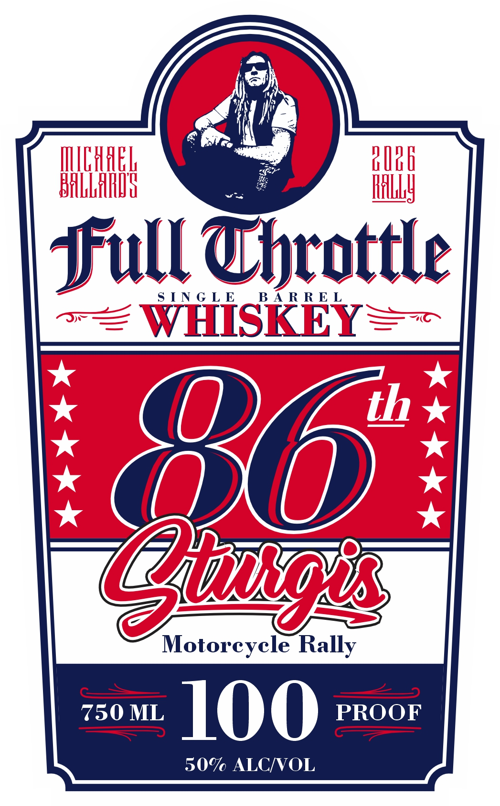

# TTB COLA Label Images - TTBID 26161001000520

**Brand Name:** FULL THROTTLE

**Issue Date:** 06/16/2026

**Origin Code:** 42

**Product Class/Type:** 140

**Source:** [TTB Public COLA Registry](https://ttbonline.gov/colasonline/viewColaDetails.do?action=publicFormDisplay&ttbid=26161001000520)

## Label Images

### Back Label

### Front Label

### Label 3

## Extracted Label Text

*Text extracted via OCR - may contain errors*

*1 image(s) excluded: text did not meet readability threshold*

**Detected Proof:** 100

### Back Label

(>

@

Motorcycle Rally

Full Throttle »

SINGLE

BARREL

‘WHISKEY=—

GOVERNMENT WARNING:

(1) According to the Surgeon

General, women should not drink

alcoholic beverages during

pregnancy because of the risk of

birth defects.

(2) Consumption of alcoholic

drive a car or operate machinery,

beverages impairs your ability to

|

and may cause health problems.

50040°81518

www fullthrottledistillery.com

BOTTLED BY: FULL THROTTLE SLOON SHINE LLC + VALE, SD

### Front Label

HlHHk
BRrH
JFull Wbtottle
S [ N G L E
B A R R E L
WHISKEY
th
86
Motorcycle Rally
750 ML
100
PROOF
50% ALCMVOL
