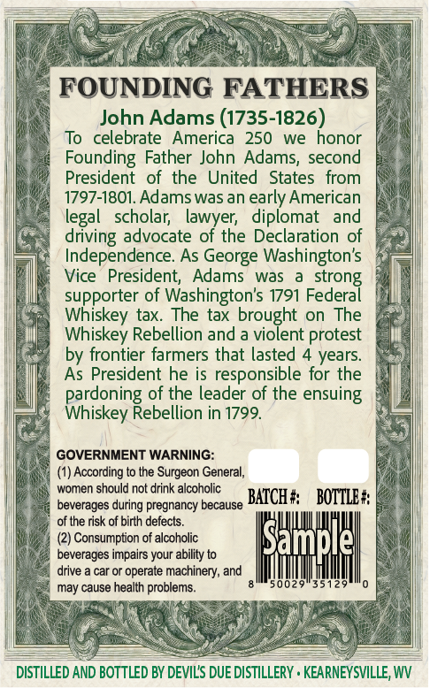
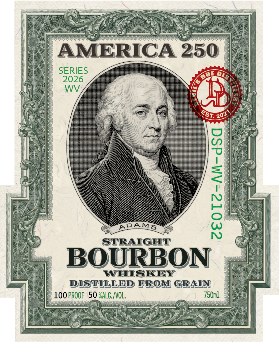
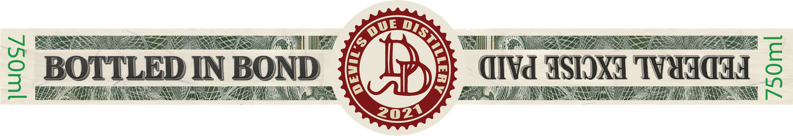

# TTB COLA Label Images - TTBID 26161001000525

**Brand Name:** DEVIL'S DUE DISTILLERY

**Fanciful Name:** AMERICA 250 ADAMS

**Issue Date:** 06/22/2026

**Origin Code:** 47

**Product Class/Type:** 111

**Source:** [TTB Public COLA Registry](https://ttbonline.gov/colasonline/viewColaDetails.do?action=publicFormDisplay&ttbid=26161001000525)

## Label Images

### Back Label

### Front Label

### Label 3

## Extracted Label Text

*Text extracted via OCR - may contain errors*

**Detected Proof:** 100
**Detected Age:** 4 Years

### Back Label

FOUNDING FATHERS
John Adams (1735-1826)
To  celebrate
America
250
we honor
Founding Father John Adams, second
President   of the
United
States   from
1797-1801. Adams was an early American
legal   scholar;
lawyer;
diplomat
and
driving advocate of the Declaration of
Independence: As George Washington's
Vice
President;
Adams was
strong
supporter of Washington's 1791 Federal
Whiskey tax.
The tax
on The
Whiskey Rebellion and
broiorent =
protest
by frontier farmers that lasted 4 years
As President he is
responsible for the
of the leader of the ensuing
Rardocyp=
Rebellion in 1799.
GOVERNMENT WARNING:
According to the Surgeon General;
women should not drink alcoholic
beverages during pregnancy because
BATCH #
BOTTLE #
of the risk of birth defects
Consumption of alcoholic
Sample
beverages impairs your ability to
drive
car or operate machinery; and
may cause health problems_
50029
35129
DISTILLED AND BOTTLED BY DEVILS DUE DISTILLERY . KEARNEYSVILLE, WV

### Front Label

AMERICA 250
SERIES
2026
WV
APAMS
1
STRAIGHT
BOURBON
WHISKEY
DISTILLED FROM GRAIN
100 pROOF 50 GALC, NVOL,
750ml
ESTe

### Label 3

sos

a:

cms /,

I$

Well one

BOTTLED IN BOND

aivd ASTOXG TWIG

ET TE NRE

CL

UN A

FER UMENIES

IN ae LE

AES

202%
