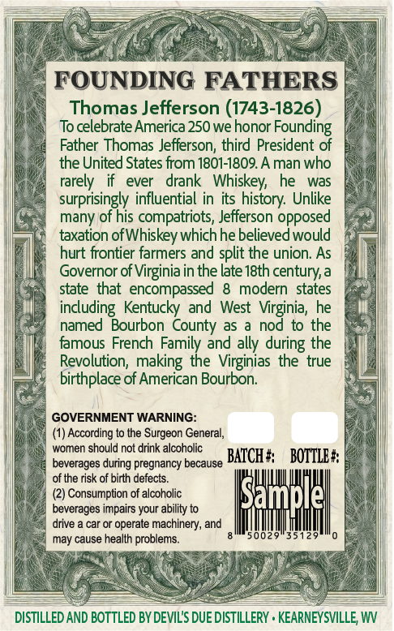
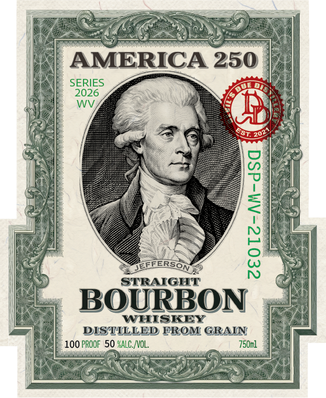

# TTB COLA Label Images - TTBID 26161001000529

**Brand Name:** DEVIL'S DUE DISTILLERY

**Fanciful Name:** AMERICA 250 JEFFERSON

**Issue Date:** 06/22/2026

**Origin Code:** 47

**Product Class/Type:** 111

**Source:** [TTB Public COLA Registry](https://ttbonline.gov/colasonline/viewColaDetails.do?action=publicFormDisplay&ttbid=26161001000529)

## Label Images

### Back Label

### Front Label

### Label 3

## Extracted Label Text

*Text extracted via OCR - may contain errors*

**Detected Proof:** 100

### Back Label

FOUNDING FATHERS
Thomas Jefferson (1743-1826)
To celebrate America 250 we honor
Founding
Father Thomas Jefferson; third President of
the United States from 1801-1809.A man who
rarely
ever
drank   Whiskey
he
was
surprisingly influential in its
Unlike
many of his compatriots, Jefferson opposed
taxation ofWhiskey which he believed would
hurt frontier farmers and split the union. As
Governor of Virginia in the late I8th century,a
state  that  encompassed
8   modern  states
including Kentucky ad West Virginia, he
named Bourbon County as
nod to the
famous French Family and ally
the
Revolution;  making the Virginias the true
birthplace of American Bourbon:
GOVERNMENT WARNING:
(1) According to the Surgeon General;
women should not drink alcoholic
beverages during pregnancy because
BATCH #;
BOTTLE #
of the risk of birth defects_
Consumption of alcoholic
ISample|
beverages impairs
ability to
drive
car or operate machinery; and
may cause health problems_
50029
35129
DISTILLED AND BOTTLED BY DEVILIS DUE DISTILLERY . KEARNEYSVILLE WV
history:
during
your

### Front Label

AMERICA 250
SERIES
2026
WV
DEEFERSOM
1
STRAIGHT
BOURBON
WHISKEY
DIS TILLED FROM GRAIN
100 PROOF 50 %ALC.NOL,
750ml

### Label 3

sos

a:

cms /,

I$

Well one

BOTTLED IN BOND

aivd ASTOXG TWIG

ET TE NRE

CL

UN A

FER UMENIES

IN ae LE

AES

202%
