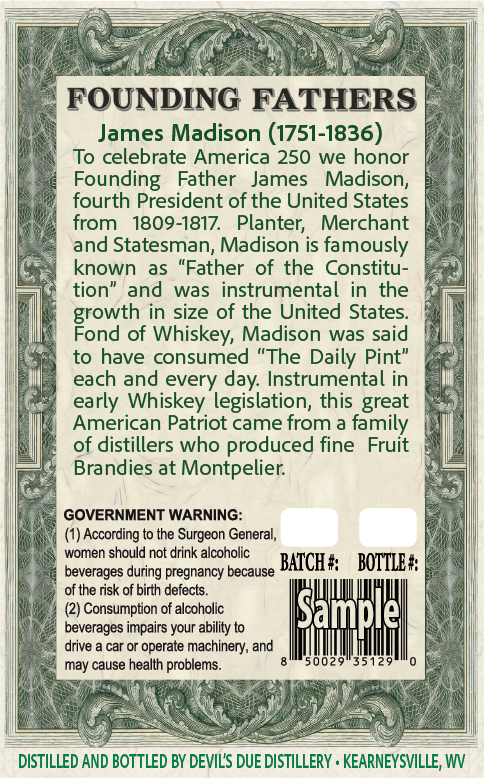
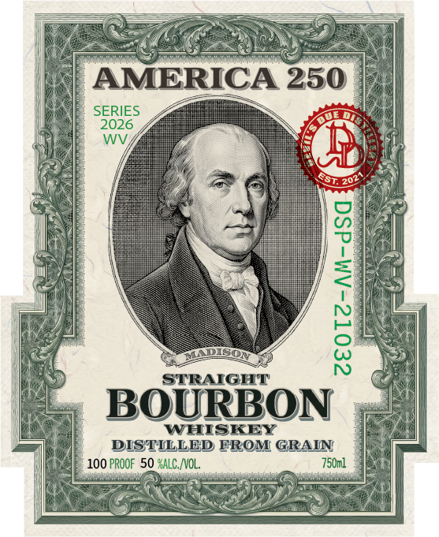

# TTB COLA Label Images - TTBID 26161001000537

**Brand Name:** DEVIL'S DUE DISTILLERY

**Fanciful Name:** AMERICA 250 MADISON

**Issue Date:** 06/22/2026

**Origin Code:** 47

**Product Class/Type:** 111

**Source:** [TTB Public COLA Registry](https://ttbonline.gov/colasonline/viewColaDetails.do?action=publicFormDisplay&ttbid=26161001000537)

## Label Images

### Back Label

### Front Label

## Extracted Label Text

*Text extracted via OCR - may contain errors*

**Detected Proof:** 100

### Back Label

FOUNDING FATHERS
James Madison (1751-1836)
To celebrate America 250 we honor
Founding
Father
James
Madison,
fourth President of the United States
from
1809-1817.
Planter;
Merchant
and Statesman, Madison is famously
known as "Father of the Constitu-
tion" and
was instrumental in
the
in size of the United States
goowatbf
of
Whiskey, Madison was said
to have consumed "The Daily Pint"
each and every
Instrumental in
early Whiskey legislation, this great
American Patriot came from a family
of distillers who produced fine
Fruit
Brandies at Montpelier:
GOVERNMENT WARNING:
(1) According to the Surgeon General;
women should not drink alcoholic
BATCH #
BOTTLE #
beverages during pregnancy because
of the risk of birth defects_
Consumption of alcoholic
Sample
beverages impairs your ability to
drive
car or operate machinery; and
may cause health problems_
5002=
3512
DISTILLED AND BOTTLED BY DEVILS DUE DISTILLERY . KEARNEYSVILLE, WV
day;

### Front Label

AMERICA 250
SERIES
2026
WV
DISO;
1
STRAIGHT
BOURBON
WHISKEY
DISTILLED FROM GRAIN
100 PROOF 50 %ALC, /VOL,
750ml
