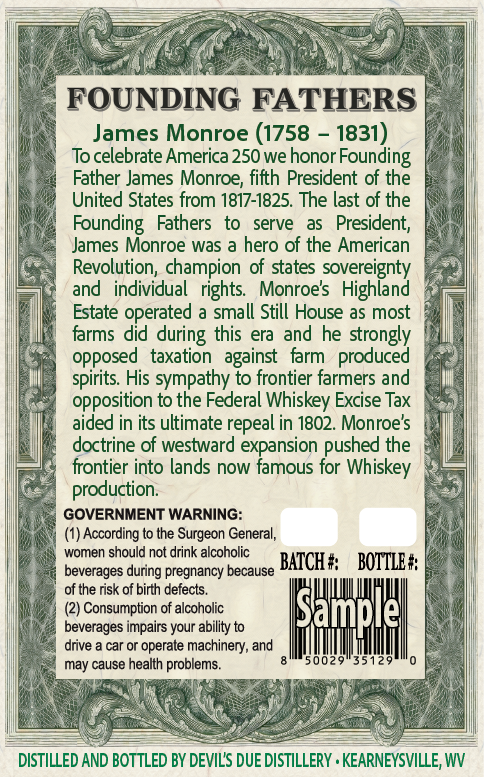
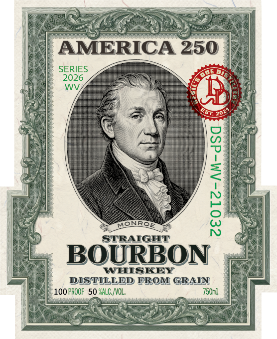

# TTB COLA Label Images - TTBID 26161001000546

**Brand Name:** DEVIL'S DUE DISTILLERY

**Fanciful Name:** AMERICA 250 MONROE

**Issue Date:** 06/22/2026

**Origin Code:** 47

**Product Class/Type:** 111

**Source:** [TTB Public COLA Registry](https://ttbonline.gov/colasonline/viewColaDetails.do?action=publicFormDisplay&ttbid=26161001000546)

## Label Images

### Back Label

### Front Label

### Label 3

## Extracted Label Text

*Text extracted via OCR - may contain errors*

*1 image(s) excluded: text did not meet readability threshold*

### Back Label

FOUNDING FATHERS
James Monroe (1758
1831)
Tocelebrate America 250 we honor
Father James Monroe; fifth President of the
United States from 1817-1825. The last of the
Founding   Fathers   to
serve
President;
James Monroe was a hero of the American
Revolution, champion of states sovereignty
and
individual   rights.
Monroes   Highland
Estate operated a small Still House as most
farms did during this era
he strongly
opposed   taxation
farm   produced
spirits His sympathy to frontier farmers and
opposition to the Federal Whiskey Excise Tax
aided in its ultimate repeal in 1802. Monroes
doctrine of westward expansion pushed the
frontier into lands now famous for Whiskey
production:
GOVERNMENT WARNING:
According to the Surgeon General;
women should not drink alcoholic
beverages during pregnancy because
BATCH #
BOTTLE #
of the risk of birth defects_
(2) Consumption of alcoholic
beverages impairs your ability to
drive
car or operate
machinery; and
may cause health problems.
50029
35129
DISTILLED AND BOTTLED BY DEVILS DUE DISTILLERY . KEARNEYSVILLE, WV
Founding
and
against
ISample

### Label 3

sos

a:

cms /,

I$

Well one

BOTTLED IN BOND

aivd ASTOXG TWIG

ET TE NRE

CL

UN A

FER UMENIES

IN ae LE

AES

202%
