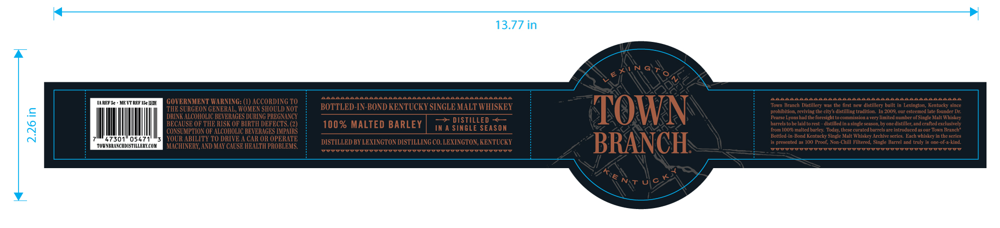
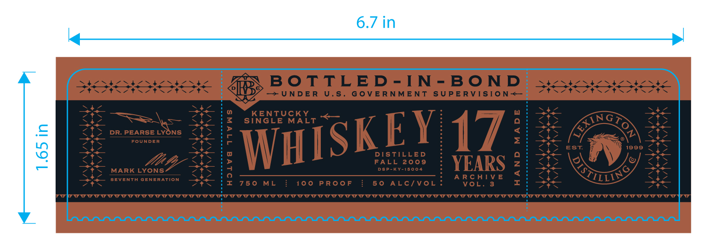
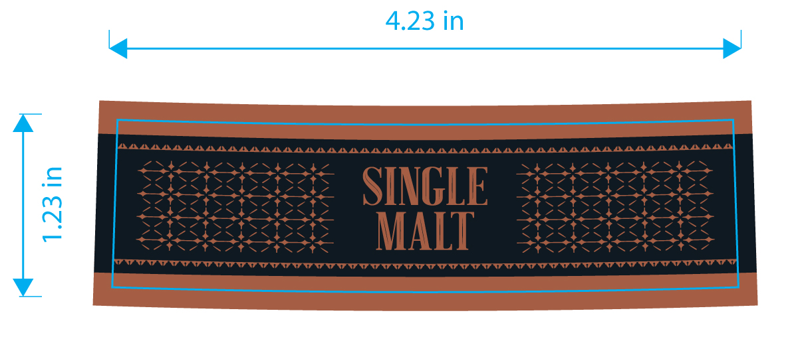

# TTB COLA Label Images - TTBID 26161001000595

**Brand Name:** TOWN BRANCH

**Fanciful Name:** BOTTLED IN BOND 17 YEAR

**Issue Date:** 06/22/2026

**Origin Code:** 22

**Product Class/Type:** 119

**Source:** [TTB Public COLA Registry](https://ttbonline.gov/colasonline/viewColaDetails.do?action=publicFormDisplay&ttbid=26161001000595)

## Label Images

### Label 1

### Label 2

### Label 3

## Extracted Label Text

*Text extracted via OCR - may contain errors*

*1 image(s) excluded: text did not meet readability threshold*

**Detected Proof:** 100

### Label 1

13.77 in
XNGT
ALAALALALAAALAALAAAAAAALAALAAAALAALAAAAALAAALAALAAALAAAAA
AA
HALAALAAAAA
F
Mamapiscmn
GOVERNMENT WARNING: (1) ACCORDING TO
BOTTLED-IV-BOND KENTUCKY SINGLE MALT WHISKEY
Kranch Distillery
te first ner
distillery built
Lexington; Kentucky
Dina
THE SURGEON GENERAL, WOMEN SILOULD NOt
TOWN
prumbiton
reviving [ne cily
distilling tradilion
estectcd late [ounder Dr:
DRRINE ALCOHOLIC BEVEILAGES DURNG PIEGNANCI
reanie Lrons hdthe [urEalentto
entlmiteunumberoleincle halt Whiiiet
DISTILLED
3
3
BECAUSE OF THE RISK OF BIRTH DEFECTS: (2)
100 % MALTED BARLEY
SINGLE SEASOH
parrelato bealdtoteat
ietilled Ima eingieseaxoml
one distiller anderantedexclusirely
CONSUMPTTON OF ALCOHOLIC BEVERAGES TMPATRS
Froin I00F maltedbarley; Teday; these curatedbarrelsane introducedaS our Town Branch
attlcdein
Hond Kentucky Single Malt Whiskey Archive scrica
Each whiskcy
thc scrics
054
YOUR ABILITY T0 DRIVE
CAR OR OPERATE
DISTILLED BY LEXINGTON DISTILLING CO LEXINGTON,KESTUCKY
BRANCH
presented
100 Proof; Non-Chill Filtered, Single Karrel and
one_ofi-knd
TOMNBRANC HDISTILLEBE C OM
MACHINERE, AXd MAY CLUSE HEALTH PROBLEMS.
Tnttnn tn
Anencannn
NT Uic
~Toum
20do
cOTt
ruly
KE

### Label 2

6.7 in
BoTTLED-IN
L
Bo ND
~UNDER
U.5 _
G OVERNMENT
SUPERVISTO N<
KENTUCKY
SINGLE MALT
DR: PEARSE LYONS
F
171
FOUNDER
9
DISTILLED
EST
1999
FALL
2009
YEARS
MARK LYONS
;
DSp-KY-15004
A R C HTV E
2
SEVENTH GEnERATION
7 5 0
ML
100
PRooF
5 0
ALC/VOL
VoL.
Inetnennnnn
Intnnennennnttnnnntnnntnnnnntnnnnnnnnnnnnnnnn
Innn
Innt
Ftn
WHISKEYL
KING>
LLIN
