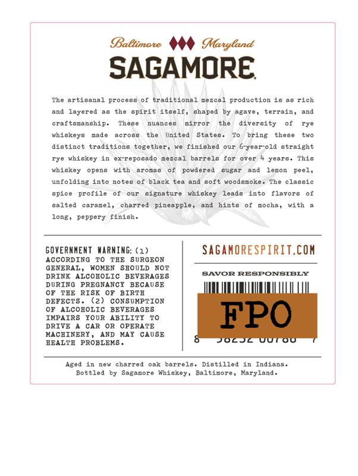
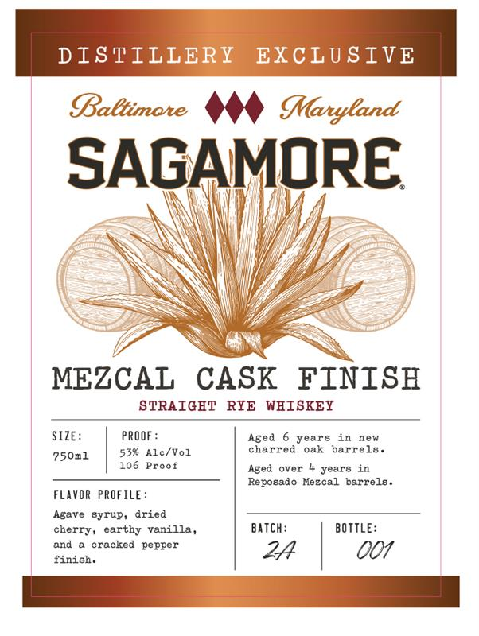

# TTB COLA Label Images - TTBID 26161001000669

**Brand Name:** SAGAMORE

**Fanciful Name:** MEZCAL CASK FINISH

**Issue Date:** 06/16/2026

**Origin Code:** 25

**Product Class/Type:** 102

**Source:** [TTB Public COLA Registry](https://ttbonline.gov/colasonline/viewColaDetails.do?action=publicFormDisplay&ttbid=26161001000669)

## Label Images

### Back Label

### Front Label

## Extracted Label Text

*Text extracted via OCR - may contain errors*

**Detected Proof:** 106
**Detected Age:** 6 Years

### Back Label

Baltimate
Manyland
SAGAMORE
The artisanal Process of traditional Eezcal production 16 a6 rich
and layered
tne Gpiri
itg0l
Ghaped
@fate ,
terraine
and
craftceanchip.
Thece
nuancee
mirror
the
divcreity
ryc
whiskeys
nade
BCTOBE
the
Dnited
States
bring
thege
distinct
traditiong
cogether
finished
6-year-old Gtriight
whickoy
HE me
Pocado
Dozcr
barrole
for
ovor
yoarc
Thio
whigkey
opens
with
JrozB
ered
BLEAT
and
lemon
unfolding into
note6
black tea
Goft woodgmoke.
The
claesic
epice
profile
Or
cignatur
whiekey
leade
into
flavors
salted
carazel,
charred
pineapple
hints
mocha,
with
long ,
Peppery finich
GOveRnMEnT MARMING: (1)
SaganORespiRIT.cOM
ACCORDING
TAE
SuRGEON
GENERAL
WOKEN
8EOULD
NOT
DRINK ALCOBOLIC
BEVERAGES
SAVOR RESPONSIELY
DURING  PREGNANCI BECAUSE
TBE
RIS
BIRTA
DEFECT8
CONSUMPTION
ALCOBOLIC
BEVERAGES
IMPAIRS
IOOR
ABILITI
FPO
DRIVE
CAR
OR
OPERATE
MACHINERY
AND
HAY
CAUSE
HEALTB
PROBLEMS
JOcj
U0T00
Aged in
new
charred oak
barrelo. Distilled in
Indiana .
Bottled
Sagamore
Whiskey ,
Baltinore
Karyland
L40
Fowd
peel

### Front Label

DISTILLERY
EXCLUSIVE
Baltimote
MMaryland
SAGAMORE
MEZCAL
CASK
FINISH
STRAIGET
RYE WBISKEY
SIZE:
PROOF :
Aged
6 years
in
new
Alc/Vol
charred
oak
barrels
750n1
106
Proof
Aged
over
years in
Reposado Mezcal
barrels .
FLAVOR PROFILE:
Agave syrup,
dried
nerry,
vanilla
Batch:
BOTTLE:
and
cracked
pepper
24
001
finish
53%
earthy
