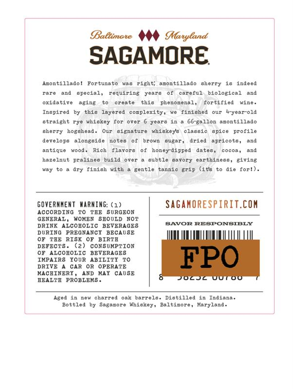
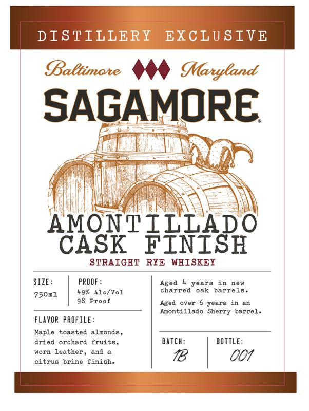

# TTB COLA Label Images - TTBID 26161001000682

**Brand Name:** SAGAMORE

**Fanciful Name:** AMONTILLADO CASK FINISH

**Issue Date:** 06/16/2026

**Origin Code:** 25

**Product Class/Type:** 102

**Source:** [TTB Public COLA Registry](https://ttbonline.gov/colasonline/viewColaDetails.do?action=publicFormDisplay&ttbid=26161001000682)

## Label Images

### Back Label

### Front Label

## Extracted Label Text

*Text extracted via OCR - may contain errors*

**Detected Proof:** 98

### Back Label

Baltimate
Maryland
SAGAMORE
Acontillado!
Fortunato
Kud
right;
acontillado
Gherry
10 indeed
rire
and
special,
requlring
yearo
careful
blological
and
oridative
1ging
create
this
Aom
ena ]
fortified
Ingpired
chis
layered
cocplexity,
finighed
our
Fyear-old
straight
whiokoy
Tor
over
ycarb
66-gallon acontillado
sherry hogshead
Our
ture
whiskeys
classic
spice
profile
developo
ong8ide
noteg
brorn
Guer
dried
aPricots,
Jnd
antique
Rich
flavors
ey-dipped
dates,
cocoa,
and
nazelnut
pralineg
build
otet
Gubtle
gtory
oarthinesG ,
giving
MuY
dry finich with
gent10
tunnic grip (it8
die
for ! )
GOveRnMEnT MARMING: (1)
SaganORespiRIT.cOM
ACCORDING
TAE
SuRGEON
GENERAL
WOKEN
8EOULD
NOT
DRINK ALCOBOLIC
BEVERAGES
SAVOR RESPONSIELY
DURING  PREGNANCI BECAUSE
TBE
RIS
BIRTA
DEFECT8
CONSUMPTION
ALCOBOLIC
BEVERAGES
IMPAIRS
IOOR
ABILITI
FPO
DRIVE
CAR
OR
OPERATE
MACHINERY
AND
HAY
CAUSE
HEALTB
PROBLEMS
JOcj
U0T00
Aged in
new
charred oak
barrelo. Distilled in
Indiana .
Bottled
Sagamore
Whiskey ,
Baltinore
Karyland
Mine
81628
Kood

### Front Label

DISTILLERY
EXCLUSIVE
Baltimate
MMaryland
SAGAMORE
AXGYT
TEf3?
STRAIGHT
RYE WBISKEY
SIZE :
PROOF :
Aged
years
in
new
49% Alc/Vol
charred
oak
barrels
750n1
Proof
Aged
over
years in
Anontillado Sherry
barrel.
FLAVOR PROFILE:
Maple
toasted
almonds
dried
orchard
fruits
Batch:
BOTTLE:
worn
leather,
and
001
citrus brine finish.
