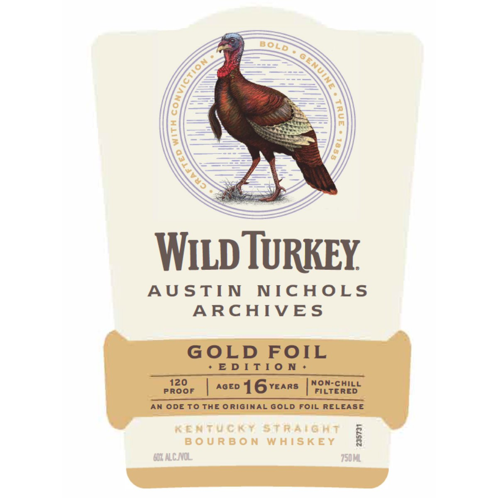
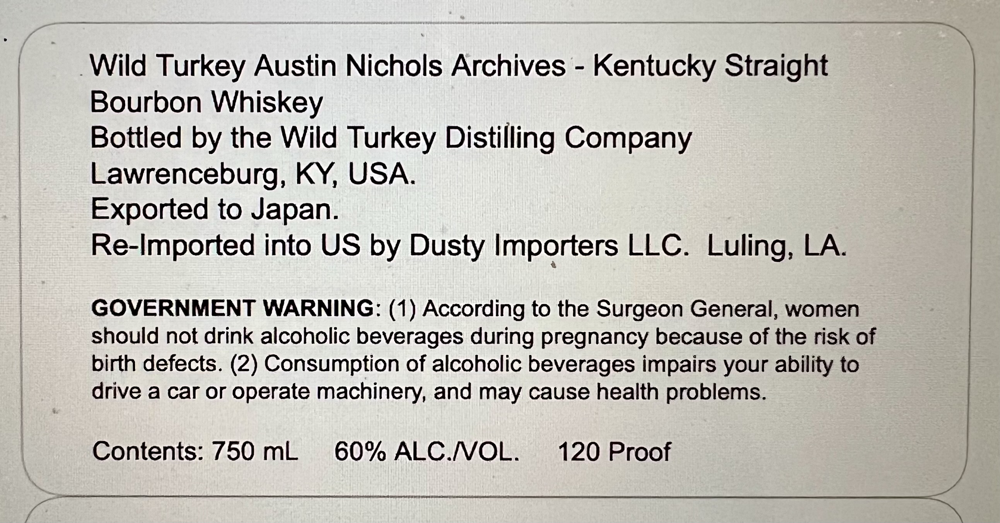

# TTB COLA Label Images - TTBID 26161001000872

**Brand Name:** WILD TURKEY AUSTIN NICHOLS ARCHIVE

**Issue Date:** 06/18/2026

**Origin Code:** 22

**Product Class/Type:** 101

**Source:** [TTB Public COLA Registry](https://ttbonline.gov/colasonline/viewColaDetails.do?action=publicFormDisplay&ttbid=26161001000872)

## Label Images

### Label 1

### Label 2

## Extracted Label Text

*Text extracted via OCR - may contain errors*

**Detected Proof:** 120
**Detected Age:** 16 Years

### Label 1

Wild TURKEY
AU STIN
NIC Hos
ARCHIVES
GoLD
FOIL
E D [ TI 0 N
120
AGED
16
YEARS
non-Chill
Proof
FILTERED
AN ODE To THE ORIginAL GOLD Foil RELEASE
KeATucky StraigHt
6
B 0 U RB 0 M
WhTS K EY
8
MI ALCNOL
750M
BOLD
GENUI
(
6

### Label 2

Wild Turkey Austin Nichols Archives
Kentucky Straight
Bourbon Whiskey
Bottled by the Wild Turkey Distilling Company
Lawrenceburg; KY, USA
Exported to Japan.
Re-Imported into US by Dusty Importers LLC. Luling; LA
GOVERNMENT WARNING: (1) According to the Surgeon General, women
should not drink alcoholic beverages during pregnancy because of the risk of
birth defects. (2) Consumption of alcoholic beverages impairs your ability to
drive a car or operate machinery, and may cause health problems.
Contents: 750 mL
60% ALCNOL.
120 Proof
