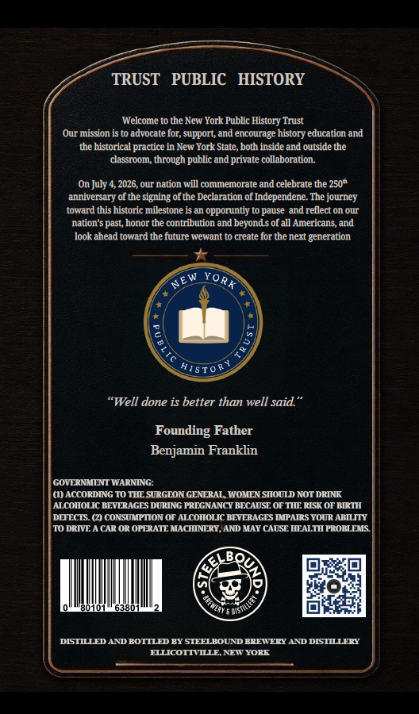
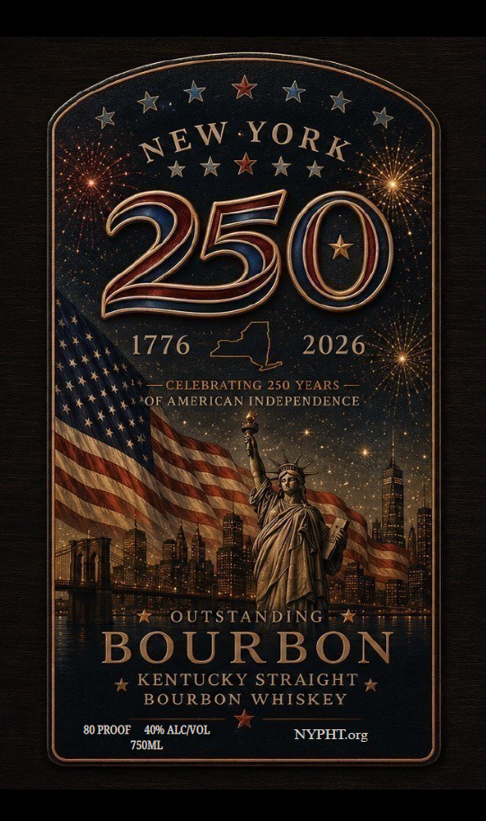

# TTB COLA Label Images - TTBID 26162001000014

**Brand Name:** NEW YORK 250

**Issue Date:** 06/16/2026

**Origin Code:** 22

**Product Class/Type:** 101

**Source:** [TTB Public COLA Registry](https://ttbonline.gov/colasonline/viewColaDetails.do?action=publicFormDisplay&ttbid=26162001000014)

## Label Images

### Back Label

### Front Label

## Extracted Label Text

*Text extracted via OCR - may contain errors*

**Detected Proof:** 80

### Back Label

TRUST
PUBLIC   HISTORY
Welcome to the New York Public _
Trust
Our mission is t0 advocate fOr; support; and encourage history education and
the historical practice in New York State, both inside and outside the
classroom; through public and private collaboration
On July=
2026,our nation will commemorate and celebrate the 250"
anniversary of the signing of the Declaration of Independene. The journey
toward this historic milestone is an opporuntiy to
and rellect on our
nation $
honor the contribution and beyonds of all Americans and
look ahead toward the future wewant t0 create for the next
generation
4E
Rt
"Well done is better than well said
Founding Father
Benjamin Franklin
GOVDRMMLNT WARNING:
(I)ACCORDING T0 TIE SURGLON GLNIRAL WOMLN SIIOULD NOT DRINK
ALCOIIOLIC BLVIRAGES DDRING PRIGNANCY BECAUSL OF TIIE RISK OT BIRTI
DHTECTS (2) CONSUMPTION OF ALCOITOLIC BEVERAGES MMPAIRS YOUR ALILITY
T0 DRIVL
CAR OR OPIRATE MACIINERY,AND MAY CAUSE IITALTTI PROBLEMS
3ot0t
63801
DISTILLEDA DBOTTLED BY STEELBOURD BREIER AADDISTLLERY
HLLICOITTLENETYORE
History
pause
past
Yoi
AIST=
'Oreteo
"ue5thl

### Front Label

NEW YORK
X K 7 *
250
1776
2026
CELEBRATING 250 YEARS
OF AMERICAN INDEPENDENCE
OUTSTANDING
BOURBON
KENTUCKY STRAIGHT
BOURBON WHISKEY
80 PROOF
4096
ALCNOL
NYPHTorg
7S0ML
