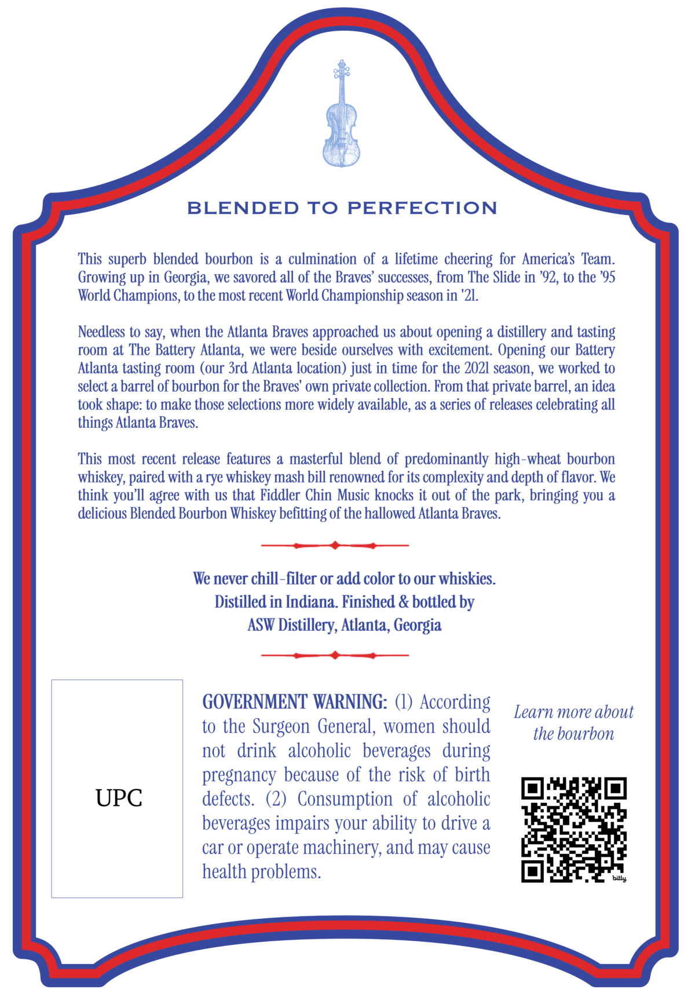
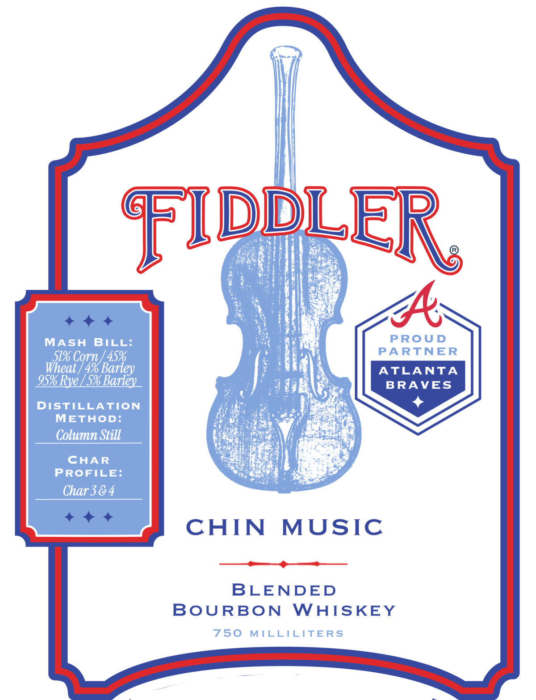
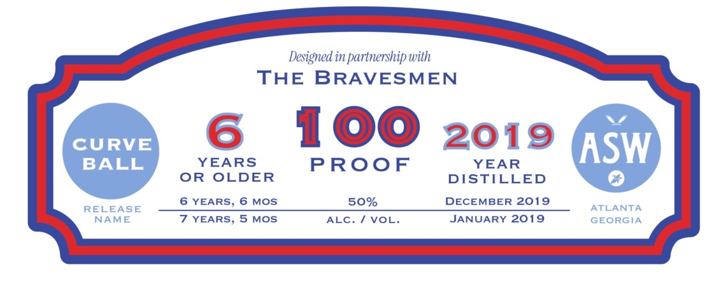

# TTB COLA Label Images - TTBID 26162001000113

**Brand Name:** FIDDLER

**Fanciful Name:** CHIN MUSIC

**Issue Date:** 07/01/2026

**Origin Code:** 08

**Product Class/Type:** 131

**Source:** [TTB Public COLA Registry](https://ttbonline.gov/colasonline/viewColaDetails.do?action=publicFormDisplay&ttbid=26162001000113)

## Label Images

### Back Label

### Front Label

### Label 2

## Extracted Label Text

*Text extracted via OCR - may contain errors*

**Detected Proof:** 100
**Detected Age:** 6 Years

### Back Label

BLENDED TO PERFECTION
This superb blended bourbon is
a culmination  of a lifetime
cheering for  Americas Team:
Growing up in Georgia, we savored all of the Braves' successes, from The Slide in '92, to the '95
World Champions, to the most recent World Championship season in '21.
Needless to say, when the Atlanta Braves approached us about opening & distillery and tasting
room at The
Battery Atlanta, we were beside ourselves with excitement. Opening our
Atlanta tasting room (our 3rd Atlanta location) just in time for the 2021 season, we worked to
select a barrel of bourbon for the Braves' own private collection. From that private barrel, an idea
took shape: to make those selections more widely available, as a series of releases celebrating all
things Atlanta Braves
This most recent release features a masterful  blend of predominantly high-wheat bourbon
whiskey, paired with a rye whiskey mash bill renowned for its complexity and depth of flavor: We
think
agree with uS that Fiddler Chin Music knocks it out of the park; bringing you a
delicious Blended Bourbon Whiskey befitting of the hallowed Atlanta Braves
We never chill-filter or add color to our whiskies
Distilled in Indiana. Finished & bottled by
ASW Distillery, Atlanta, Georgia
GOVERNMENT WARNING: (l) According
Learn more about
to the Surgeon General, women should
the bourbon
not
drink   alcoholic   beverages   during
pregnancy because of the risk of birth
UPC
defects   (2)   Consumption   of  alcoholic
beverages impairs your ability to drive a
car Or operate machinery, and may cause
health problems.
billy
Battery
you'IL

### Front Label

Reto

u

4

A

MASH BILL:

PROUD

51% Corn /45%

PARTNER

at /4% Bari

ATLANTA

95% Rye/5% Barley

BRAVES

ay

\

DISTILLATION

+

METHOD:

Column Still

pese

ff

rains

pies

CHAR

PROFILE:

Char 3&4

CHIN MUSIC

———_¢—

BLENDED

BOURBON WHISKEY

750 MILLILITERS

### Label 2

Designed in partnership with
THE BRAVESMEN
CURVE
6
100
2019
ASW
BALL
YEARS
PROoF
YEAR
OR
OLDER
DISTILLED
6 YEARS, 6 MOS
50%
DECEMBER 2019
RELEASE
ATLANTA
NAME
7 YEARS, 5 MOS
ALC.
VOL:
JANUARY 2019
GEORGIA
