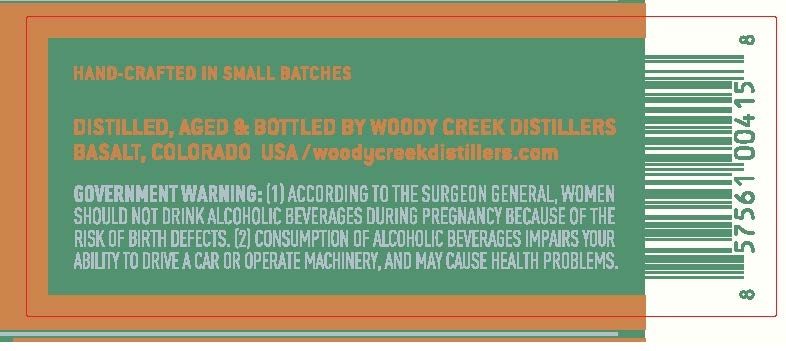
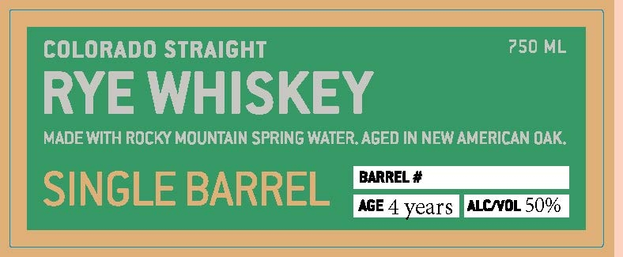

# TTB COLA Label Images - TTBID 26162001000137

**Brand Name:** WOODY CREEK DISTILLERS

**Issue Date:** 09/03/2026

**Origin Code:** 13

**Product Class/Type:** 102

**Source:** [TTB Public COLA Registry](https://ttbonline.gov/colasonline/viewColaDetails.do?action=publicFormDisplay&ttbid=26162001000137)

## Label Images

### Back Label

### Front Label

## Extracted Label Text

*Text extracted via OCR - may contain errors*

**Detected Age:** 4 Years

### Back Label

HANL-Craftem IM sMALL BATCHES
DISTILLEd;Ageda bottLed BX Woddy Greek DISTILLERS
BASALT; COLORADO USA / woodyereekdistillerE cem`
GOVERNMENT WARNING: (1) ACCORDING TO THE SURGEON GENERAL, WOMEN
SHOULD NOT DRINK ALCOHOLIC BEVERAGES DURING PREGNANCY BECAUSE OF THE
RISK OF BIRTH DEFECTS. (2) CONSUMPTION QF ALCOHOLIC BEVERAGES IMPAIRS YQUR
ABILIY TO DRIE A CAR OR OPERATE MACHINERY,AND May CAUSE HEALTH PROBLEMS.

### Front Label

COLORADO STRAIGHT
750 ML
RYE WHISKEY
MADE WITH ROcKY MOUNTAIN SPRING WATER.AGED IN NEW AMERICAN OAK:
BARREL #
SINGLE BARREL
AGE 4 years
ALCNOL 509
