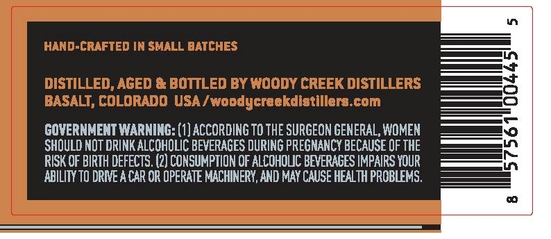
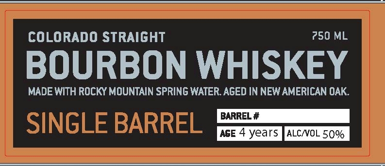

# TTB COLA Label Images - TTBID 26162001000146

**Brand Name:** COLORADO STRAIGHT

**Issue Date:** 06/17/2026

**Origin Code:** 13

**Product Class/Type:** 101

**Source:** [TTB Public COLA Registry](https://ttbonline.gov/colasonline/viewColaDetails.do?action=publicFormDisplay&ttbid=26162001000146)

## Label Images

### Back Label

### Front Label

## Extracted Label Text

*Text extracted via OCR - may contain errors*

**Detected Age:** 4 Years

### Back Label

HAND-CRAFTED IN SMALL BATCHES
DISTILLED, AGED & BOTTLED BY WOODY CREEK DISTILLERS
BASALT, COLORADD USA / woodycreekdietillere com
GOVERNMENT WARNING: (1) ACCORDING TO THE SURGEON GENERAL, WOMEN
ShoulD NOT DRINK ALCOhOLIC BEVERAGES DURInG PREGNANCY BECAUSE OF THE
RISK OF BIRTH DEFECTS. (2) CONSUMPTION OF ALCOHOUC BEVERAGES IMPAIRS YOUR
ABILITY TO DRIE A CAR OR OPERATE MACHINERY, AND MAY CAUSE HEALTH PROBLEMS.

### Front Label

COLORADO STRAIGHT
750 ML
BOURBON WHISKEY
MADE WITH ROCKY MOUNTAIN SPRING WATER. AGED IN NEW AMERICAN OAK.
BARREL #
SINGLE BARREL
ASE 4 years
ALCNOL 50%
