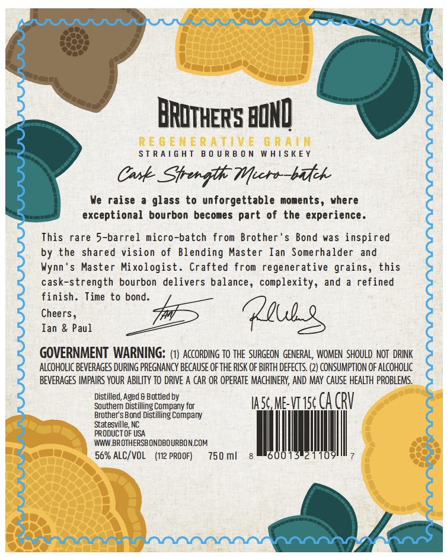
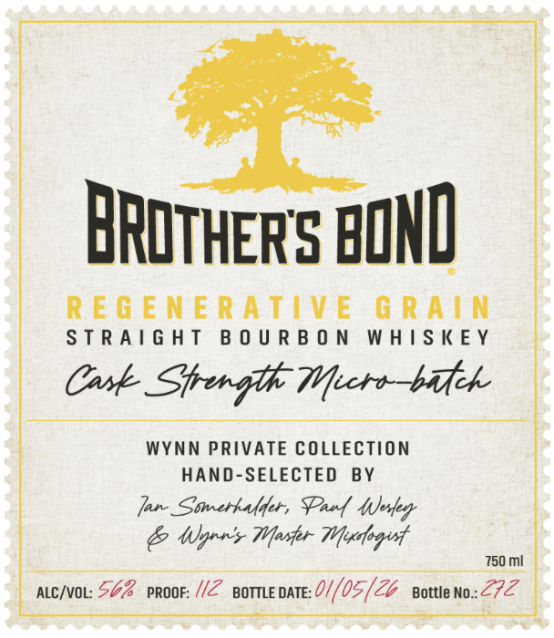
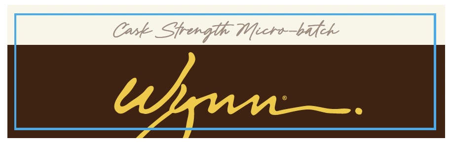

# TTB COLA Label Images - TTBID 26162001000221

**Brand Name:** BROTHER'S BOND

**Issue Date:** 06/18/2026

**Origin Code:** 35

**Product Class/Type:** 101

**Source:** [TTB Public COLA Registry](https://ttbonline.gov/colasonline/viewColaDetails.do?action=publicFormDisplay&ttbid=26162001000221)

## Label Images

### Back Label

### Front Label

### Label 3

## Extracted Label Text

*Text extracted via OCR - may contain errors*

*1 image(s) excluded: text did not meet readability threshold*

**Detected Proof:** 112

### Back Label

STRAIGHT BOURBON WHISKEY

Cask Sper gl Wecro—bafek

We raise a glass to unforgettable moments, where
exceptional bourbon becomes part of the experience.

This rare 5-barrel micro-batch from Brother's Bond was inspired
by the shared vision of Blending Master Ian Somerhalder and
Wynn's Master Mixologist. Crafted from regenerative grains, this

cask-strength bourbon delivers balance, complexity, and a refined

finish. Time to bond.
Cheers, (Ll
Tan & Paul

GOVERNMENT WARNING: (1) ACCORDING T0 THE SURGEON GENERAL, WOMEN SHOULD NOT DRINK
ALCOHOLIC BEVERAGES DURING PREGNANCY BECAUSE OF THE RISK OF BIRTH DEFECTS. (2) CONSUMPTION OF ALCOHOLIC
BEVERAGES IMPAIRS YOUR ABILITY TO DRIVE A CAR OR OPERATE MACHINERY, AND MAY CAUSE HEALTH PROBLEMS.

Distilled, Aged 6 Bottled by

SSE ea TI tase me-vr1se CA (RV
Brother's Bond bistilling Company
‘Statesville, NC
PRODUCT OF USA
WWW BROTHERSBONDBOURBON.COM
750ml 8 rd

56% ALC/VOL (112 PROOF)

### Front Label

ray

ante

BROTHER'S BOND

REGENERATIVE GRAIN

STRAIGHT BOURBON WHISKEY

Cask Sprerglh Wecro—bifck

WYNN PRIVATE COLLECTION

HAND-SELECTED BY

fare Stwrerhaflfer, Pau 4Jesfey

& Wyrs Mosler Mesfogud

750 mi

- ope: $62 vroor: //Z porneoate:0//05/Z pattie no: el
