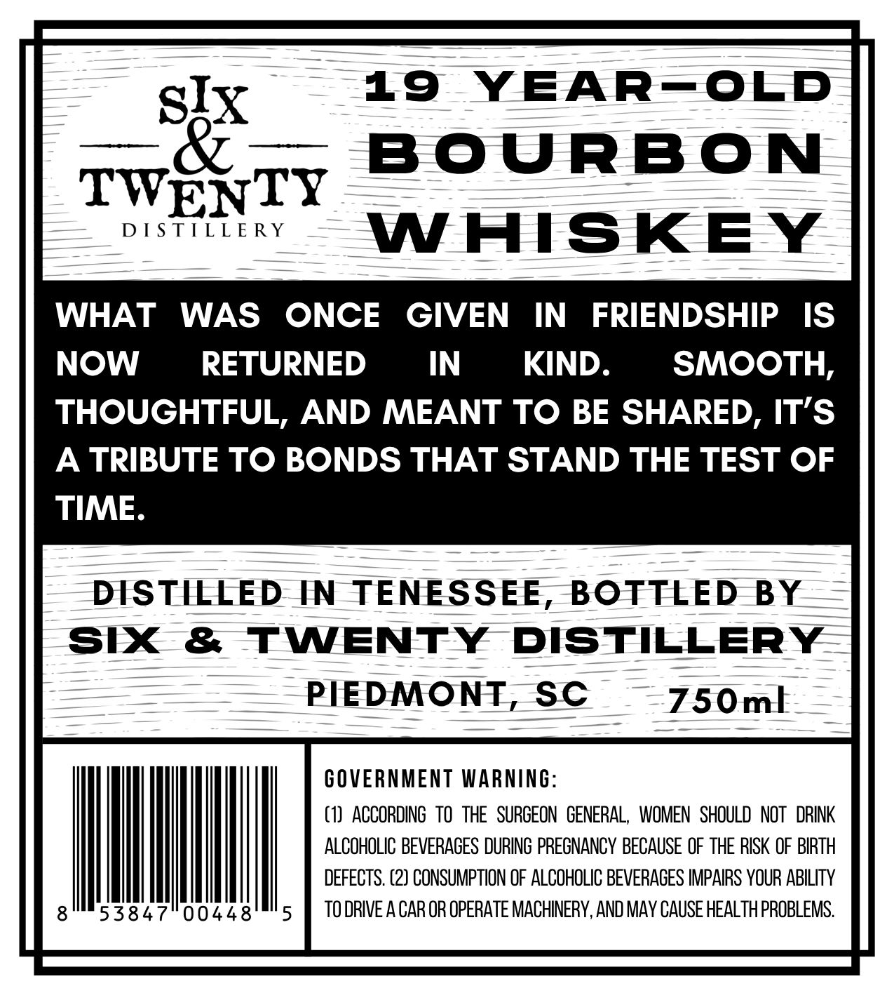
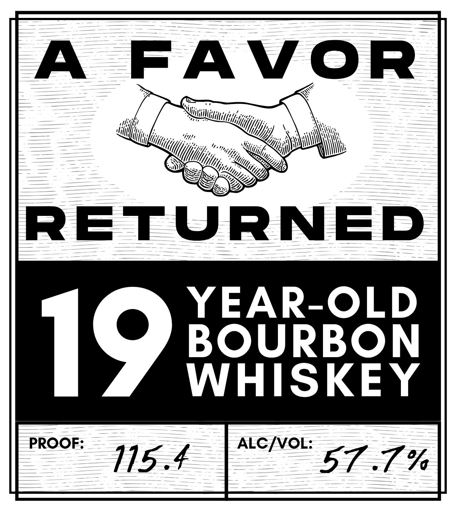

# TTB COLA Label Images - TTBID 26162001000254

**Brand Name:** A FAVOR RETURNED

**Issue Date:** 06/30/2026

**Origin Code:** 41

**Product Class/Type:** 141

**Source:** [TTB Public COLA Registry](https://ttbonline.gov/colasonline/viewColaDetails.do?action=publicFormDisplay&ttbid=26162001000254)

## Label Images

### Back Label

### Front Label

## Extracted Label Text

*Text extracted via OCR - may contain errors*

*1 image(s) excluded: text did not meet readability threshold*

### Back Label

STx
19
YEAREOED
BOuRBON
TWENTY
D [S TILLE RY
WAISKEY
WHAT
WAS
ONCE
GIVEN
IN
FRIENDSHIP
IS
NOW
RETURNED
IN
KIND.
SMOOTH,
THOUGHTFUL, AND MEANT TO BE SHARED, IT'S
A TRIBUTE TO BONDS THAT STAND THE TEST OF
TIME
DISTILLED
IN
TENESSEE
BOTTLED
BY
Six
&
TWENTY
DISTILLERY
PIEDMONT
SC
750m|
GOVERNMENT WARNING:
(1)  ACCORDING   tO  THE   SURGEON   GENERAL,  WOMEN   SHOULD   NOT   DRINK
ALCOHOLIC BEVERAGES DURING PREGNANCY BECAUSE OF THE RSK OF BIRTH
DEFECTS. (2) CONSUMPTION OF ALCOHOLIC BEVERAGES IMPAIRS YOUR ABILITY
53847
00448
5
TO DRIVE A CAR OR OPERATE MACHINERY, AND MAY CAUSE HEALTH PROBLEMS:
