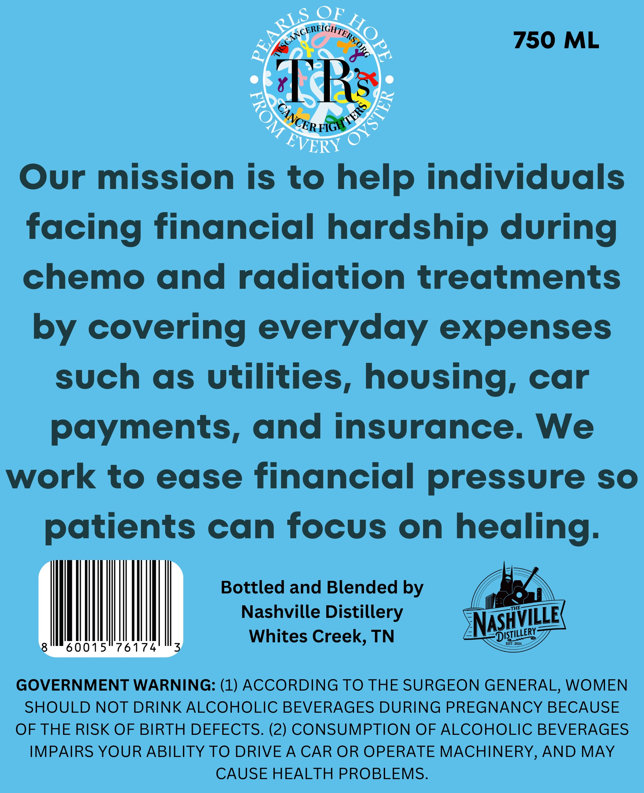
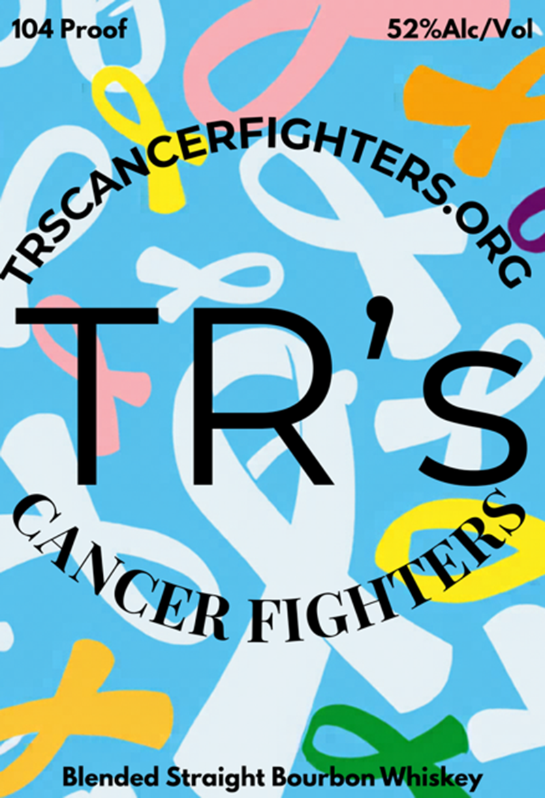

# TTB COLA Label Images - TTBID 26162001000257

**Brand Name:** TR'S

**Issue Date:** 07/09/2026

**Origin Code:** 43

**Product Class/Type:** 121

**Source:** [TTB Public COLA Registry](https://ttbonline.gov/colasonline/viewColaDetails.do?action=publicFormDisplay&ttbid=26162001000257)

## Label Images

### Back Label

### Front Label

## Extracted Label Text

*Text extracted via OCR - may contain errors*

**Detected Proof:** 104

### Back Label

~ANCERFIGHTER
750
ML
EVERY
Our mission is to help individuals
facing financial hardship during
chemo and radiation treatments
covering everyday expenses
such
as utilities, housing, car
payments, and insurance. We
work to
ease financial pressure
SO
patients can focus on healing_
Bottled and Blended by
THE
Nashville Distillery
NSHTLL
Whites Creek, TN
EST: 2024
60015"76174
3
GOVERNMENT WARNING: (1) ACCORDING TO THE SURGEON GENERAL, WOMEN
SHOULD NOT DRINK ALCOHOLIC BEVERAGES DURING PREGNANCY BECAUSE
OF THE RISK OF BIRTH DEFECTS. (2) CONSUMPTION OF ALCOHOLIC BEVERAGES
IMPAIRS YOUR ABILITY TO DRIVE A
CAR OR OPERATE MACHINERY, AND MAY
CAUSE HEALTH PROBLEMS.
OF
REARLS
0
0
9
GWCERFGNS
by
DISTILLERY _

### Front Label

104 Proof
52%Alc/Vol
S
Blended Straight Bourbon Whiskey
CeRFIGHTERSORO
TRSCAN
TR
CERS
CANCER
FIGH
