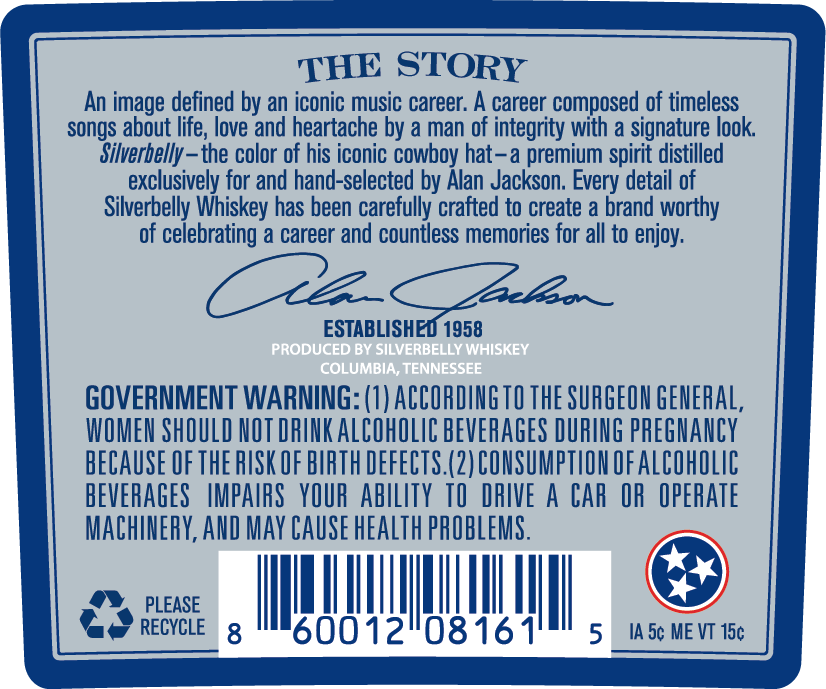
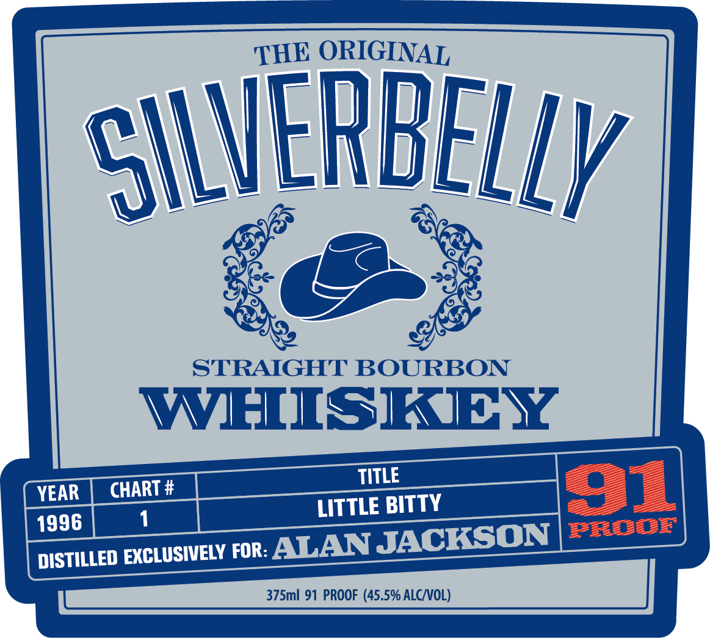
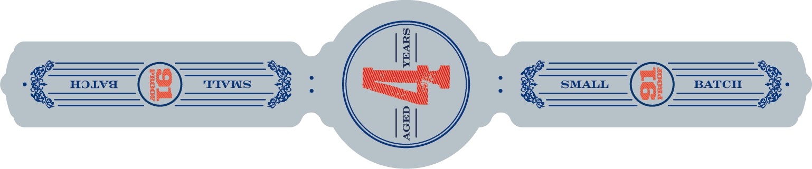

# TTB COLA Label Images - TTBID 26162001000273

**Brand Name:** SILVERBELLY WHISKEY

**Issue Date:** 06/18/2026

**Origin Code:** 43

**Product Class/Type:** 101

**Source:** [TTB Public COLA Registry](https://ttbonline.gov/colasonline/viewColaDetails.do?action=publicFormDisplay&ttbid=26162001000273)

## Label Images

### Back Label

### Front Label

### Label 3

## Extracted Label Text

*Text extracted via OCR - may contain errors*

*1 image(s) excluded: text did not meet readability threshold*

**Detected Proof:** 91

### Back Label

THE STORY
An image defined by an iconic music career: A career composed of timeless
songs about life, love and heartache by a man of integrity with a signature look
Silverbelly _ the color of his iconic cowboy hat- a premium spirit distilled
exclusively for and hand-selected by Alan Jackson; Every detail of
Silverbelly Whiskey has been carefully crafted to create a brand worthy
of celebrating a career and countless memories for all to enjoy:
2eeso _
ESTABLISHED 1958
PRODUCED BY SILVERBELLY WHISKEY
COLUMBIA, TENNESSEE
GOVERNMENT WARNING: (1) ACCORDINGTO THE SURGEON GENERAL,
WOMEN ShOULD NOT DRINK ALCOhOLIC BEVERAGES DURING pEGHANCY
BECAUSE Of thE RUSK OF BIRTH defects.(2) CONSUMPTLON OFALCOhOLic
BEVERAGES   IMPAIRS   YOUR abilIty TO  DRIVE A CAr OR  OPERATE
MachinERY, AND May CAuSe healTh PROBLEMS .
PLEASE
RECYCLE
8
60012"08161
5
IA 5c ME VT I5c

### Front Label

ORIGINAL
SILVERBELLY
STRAIGHT BOURBON
WHISKEY
TITLE
YEAR
CHART #
BITTY
91
LITTLE
1996
1
FODr
DISTILLED EXCLUSIVELY FOR ALAN
JACKSON
375m 91 PROOF (45.5% ALCNOL)
THE
