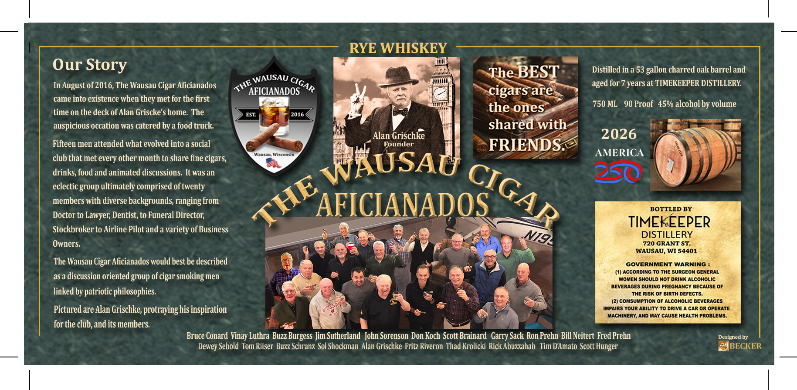

# TTB COLA Label Images - TTBID 26162001000298

**Brand Name:** TIMEKEEPER DISTILLERY

**Fanciful Name:** THE WAUSAU CIGAR AFICIANADOS RYE WHISKEY

**Issue Date:** 06/17/2026

**Origin Code:** 48

**Product Class/Type:** 142

**Source:** [TTB Public COLA Registry](https://ttbonline.gov/colasonline/viewColaDetails.do?action=publicFormDisplay&ttbid=26162001000298)

## Label Images

### Label 1

## Extracted Label Text

*Text extracted via OCR - may contain errors*

**Detected Proof:** 90
**Detected Age:** 7 Years

### Label 1

RYE WHISKEY
Our Story
The BEST
Distilled in a 53
charred oak barrel and
In August of 2016, The Wausau Cigar Aficianados
WAUSAU
aged for 7 years at TIMEKEEPER DISTILLERY
AFICIANADOS
cigars are
came into existence when
met for the first
the ones
750 ML
90 Proof  45% alcohol by volume
time on the deck of Alan Griscke'$ home. The
EST
2016
auspicious occation was catered by a food truck
shared with
Alan Grischke
2026
Fifteen men attended what evolved into a social
Founder
FRIENDS
Udutu
Mtcuntin
AMERICA
club that met every other month to share fine cigars,
drinks, food and animated discussions It was an
WKUSAC
eclectic group ultimately comprised of twenty
members with diverse backgrounds, ranging from
AFICIANADOS
BOTTLED BY
Doctor to
Lawyer; Dentist, to Funeral Director;
Stockbroker to Airline Pilot and a variety of Business
TIMEKEEPER
DISTILLERY
Owners:
720 GRANT ST.
WAUSAU, WI 54401
Wausau Cigar Aficianados would best be described
GOVERNMENT WARNING
(1) AccoRding To The SURGEOn GENERAL
as a discussion oriented group of cigar smoking men
WoMEN SHOULD Not Drink AlcohOLiC
BEVERAGES DURING PREGNANCY BECAUSE OF
linked by patriotic philosophies:
The Risk Of Birth DEFECTS:
(2) comsumption Of Alcoholic BEVERAGES
Pictured are Alan Grischke; protraying his inspiration
ImpAiRS Your AbiLitY To DRIVE
CAR Or OPERATE
MachIneRY; AND MAy cAuSE HEALTH PROBLEMS:
for the club, and its members:
Bruce Conard Vinay Luthra Buzz Burgess Jim Sutherland  John Sorenson Don Koch Scott Brainard   Garry Sack Ron Prehn Bill Neitert Fred Prehn
Designed by
Dewey Sebold Tom Riiser Buzz Schranz Sol Shockman Alan Grischke Fritz Riveron Thad Krolicki Rick Abuzzahab  Tim DAmato Scott Hunger
BECKER
gallon
CIGAR
THE
they -
CIGAR
THE
N194
The
7uny
