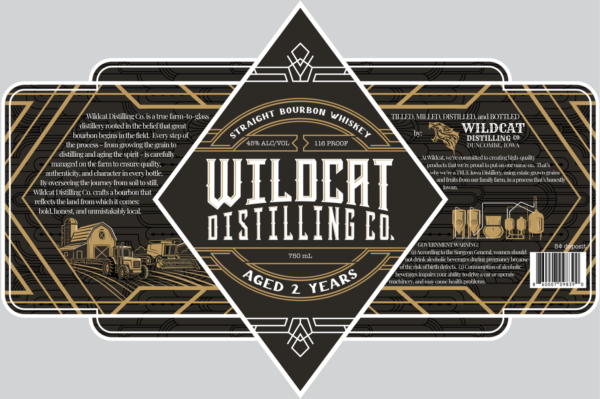

# TTB COLA Label Images - TTBID 26162001000332

**Brand Name:** WILDCAT DISTILLING, CO.

**Issue Date:** 06/25/2026

**Origin Code:** 20

**Product Class/Type:** 101

**Source:** [TTB Public COLA Registry](https://ttbonline.gov/colasonline/viewColaDetails.do?action=publicFormDisplay&ttbid=26162001000332)

## Label Images

### Label 1

## Extracted Label Text

*Text extracted via OCR - may contain errors*

**Detected Proof:** 90

### Label 1

Wildcal Distilling Co.is a true farm-to-glass
BOURBON
TILLEDMILLED, DISTILLED,and BOTTLED
distilleryrooted in the belief that
WILDCAT
boubon beginsin the field
step of
by
DISTILLING c
the process
fiom growing the
lo
45% ALC/VOL
116 PROOF
DUNCOMBE IOWA
distilling and aging the spirit
is carefullv
AtWildcat were committedto creatinghigh-quality
managed on the farm to ensure qualily;
products that weve proud to puton or name on  Thals
authenticily,and characterin every bottle
whywereaTRUE Iowa Distillery using estate gTOwn grains
By overseeing the journey fiom soil to still,
WILDCHT
and fiuits fiom our lamily farm ina process that shonestly
lowal
Wildcat Distilling Co  craltsa boubon that
rellects the land from whichit comes:
bold, honest and unmistakablylocal.
#ISTILLIHF Ci
GOVERNMENT WARVING
50 deposit
According to the Sugeon General; women should
750 mL
notdrink alcoholic beverages during pregnancy because
oftherisk ofbirth delects
Consumption ol alcoholic
beverages impairs your ability to drivea car or operate
mnachinery.and mav cause health problems
00
09839
2
STRAIGHT
WHISKEY
great
Every
grain
YEARS
AGED
