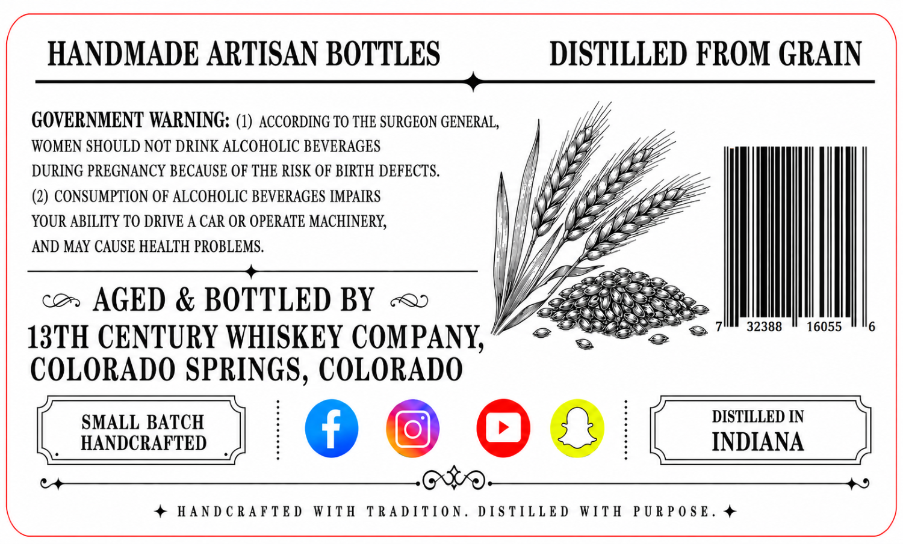
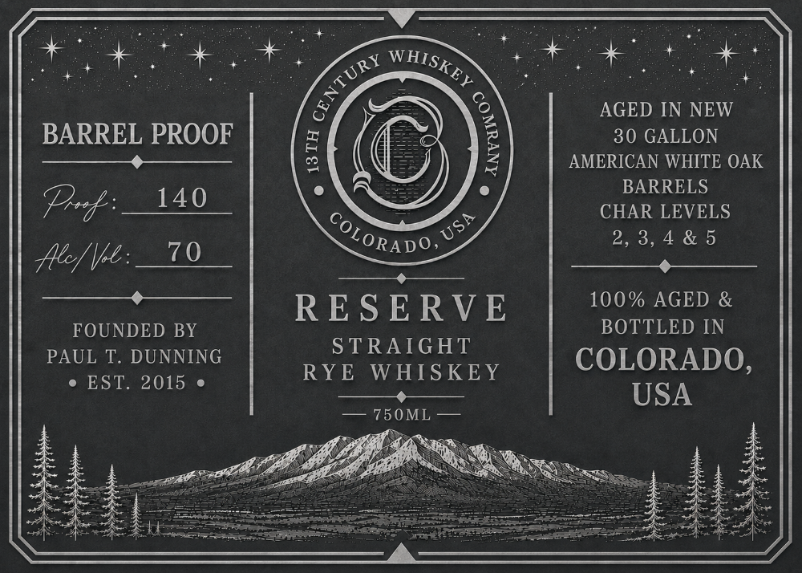

# TTB COLA Label Images - TTBID 26162001000362

**Brand Name:** 13TH CENTURY WHISKEY COMPANY

**Issue Date:** 06/18/2026

**Origin Code:** 13

**Product Class/Type:** 102

**Source:** [TTB Public COLA Registry](https://ttbonline.gov/colasonline/viewColaDetails.do?action=publicFormDisplay&ttbid=26162001000362)

## Label Images

### Back Label

### Front Label

## Extracted Label Text

*Text extracted via OCR - may contain errors*

### Back Label

GOVERNMENT WARNING: (1) ACCORDING TO THE SURGEON GENERAL,
WOMEN SHOULD NOT DRINK ALCOHOLIC BEVERAGES

DURING PREGNANCY BECAUSE OF THE RISK OF BIRTH DEFECTS.
(2) CONSUMPTION OF ALCOHOLIC BEVERAGES IMPAIRS

YOUR ABILITY TO DRIVE A CAR OR OPERATE MACHINERY,

*,

' HANDMADE ARTISAN BOTTLES DISTILLED FROM GRAIN
nnn ieee
AND MAY CAUSE HEALTH PROBLEMS.

co AGED & BOTTLEDBY ~ WZ = ‘ i
13TH CENTURY WHISKEY COMPANY,” °°e itil
COLORADO SPRINGS, COLORADO

SMALL BATCH DISTILLED IN
_ HANDCRAFTED | INDIANA

= + HANDCRAFTED WITH TRADITION. DISTILLED WITH PURPOSE. a

### Front Label

BARREL PROOF

pip a
ey ee

FOUNDED BY
PAUL T. DUNNING
e EST. 2015 e

RESERVE

STRAIGHT
RYE WHISKEY

mR AT pet Sos
E soUML

AGED IN NEW
30 GALLON
AMERICAN WHITE OAK
BARRELS
CHAR LEVELS
2,3,4&5
a a a ae

100% AGED &
BOTTLED IN

COLORADO,
