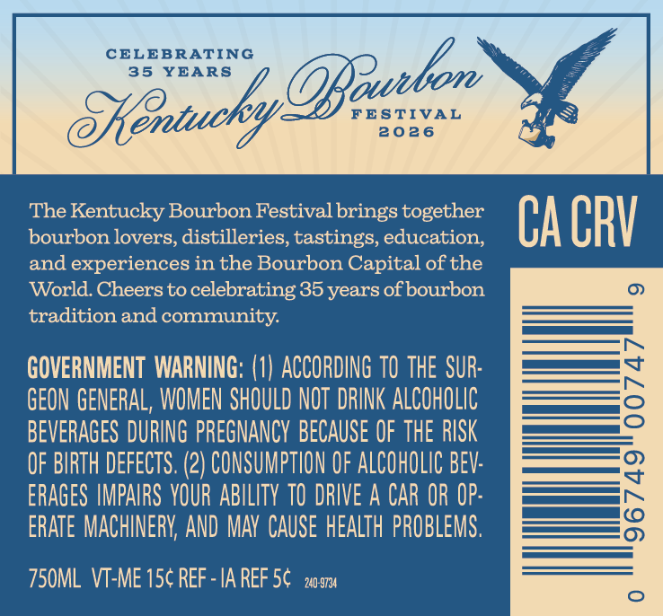
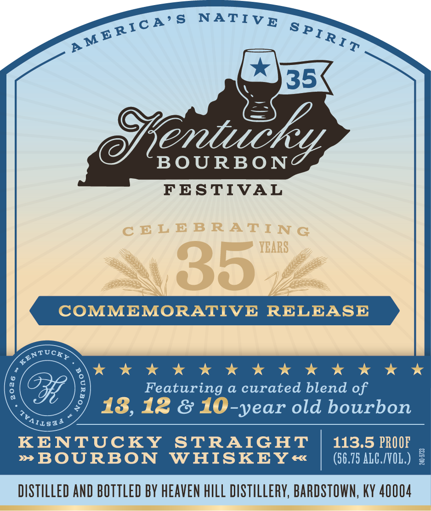

# TTB COLA Label Images - TTBID 26162001000496

**Brand Name:** KENTUCKY BOURBON FESTIVAL

**Fanciful Name:** COMMEMORATIVE RELEASE

**Issue Date:** 06/17/2026

**Origin Code:** 22

**Product Class/Type:** 101

**Source:** [TTB Public COLA Registry](https://ttbonline.gov/colasonline/viewColaDetails.do?action=publicFormDisplay&ttbid=26162001000496)

## Label Images

### Back Label

### Front Label

## Extracted Label Text

*Text extracted via OCR - may contain errors*

**Detected Proof:** 113.5
**Detected Age:** 35 Years

### Back Label

CELEBRATING
35
YEARS
JeraazkyOBealer
FES TIVAL
2026
The Kentucky Bourbon Festival brings together
Ca CRV
bourbon lovers, distilleries, tastings, education;
and experiences in the Bourbon Capital of the
World Cheers to celebrating 35 years ofbourbon
tradition and community
GOVERNMENT WARNING; (1) ACCORDING TO ThE SUR:
GEON GENERAL, WOMEN SHOULD NOT DRINK ALCOHOLIC
8
BEVERAGES DURING PREGNANCY BECAUSE OF THE RISK
OF BIRTH DEfECTS. (2) CONSUMPTHON OF ALCOHOLIC BEV:
ERAGES IMPAIRS VOUR ABILITV TO DRIVE A CAR OR OP:
8
ERATE MACHINERV; AND MAY CAUSE health PROBLEMS.
750ML VT-ME 15c REF - IA REF 5c   2209734

### Front Label

mone NATIVE
Ms
b>

py icniucky

FESTIVAL

COMMEMORATIVE RELEASE

KKK KKK Kh KKK KKK
Featuring a curated blend of

13, 12 & 10-year old bourbon

KENTUCKY STRAIGHT | 113.5 PROOF
~»BOURBON WHISKEY «€ | (675 ALC/V0L) ¢

DISTILLED AND BOTTLED BY HEAVEN HILL DISTILLERY, BARDSTOWN, KY 40004
