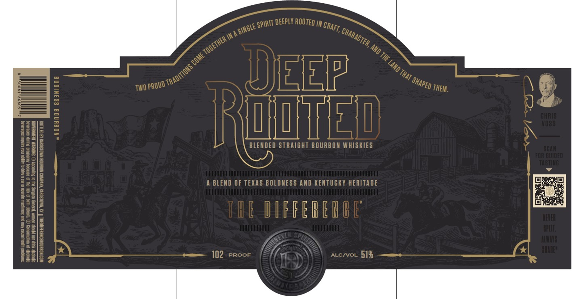
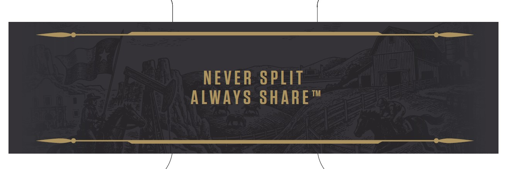

# TTB COLA Label Images - TTBID 26162001000498

**Brand Name:** THE DIFFERENCE

**Issue Date:** 07/01/2026

**Origin Code:** 22

**Product Class/Type:** 121

**Source:** [TTB Public COLA Registry](https://ttbonline.gov/colasonline/viewColaDetails.do?action=publicFormDisplay&ttbid=26162001000498)

## Label Images

### Label 1

### Label 2

## Extracted Label Text

*Text extracted via OCR - may contain errors*

*1 image(s) excluded: text did not meet readability threshold*

**Detected Proof:** 102

### Label 1

deePLY ROOTED IN
In
7
UEEP
8
1
TWO
8
8
DJ
IR
@TEE@
84318
M
1
08s
3
3
BLENDED STRAIGHT BOURBON WHISKIES
Sea
]
|
FOA BUdED
L
1
8

A BLEND OF TEXAS BOLDNESS AND KENTUCKY HERITAGE
8
1
Ii
THE DIF FEREIBE
HERES
8
H
HIE
3
'3HSOE'
102
PROOF
ALCNvOL
518
SPIRIT
ICRAFT; [
SINGLE =
,CHARACTER,
togeThER
' AND
4
COME
Land ^
TRADITIONS =
That "
'SHAPED
PROUD ^
THEM.
