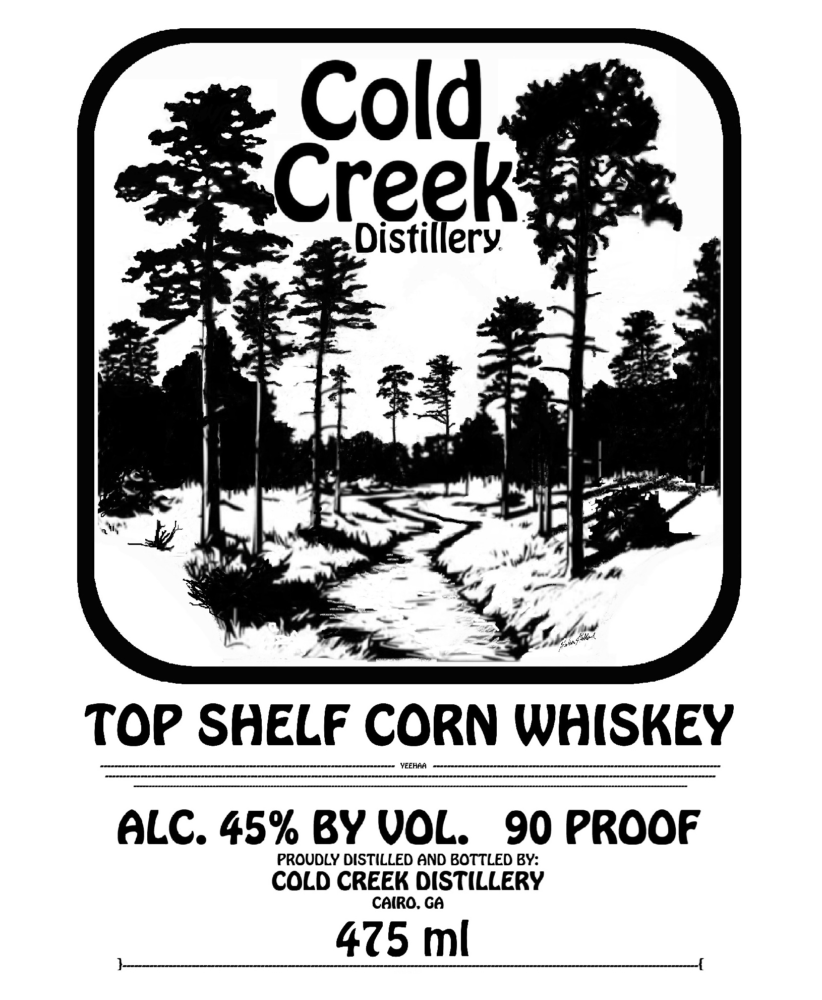
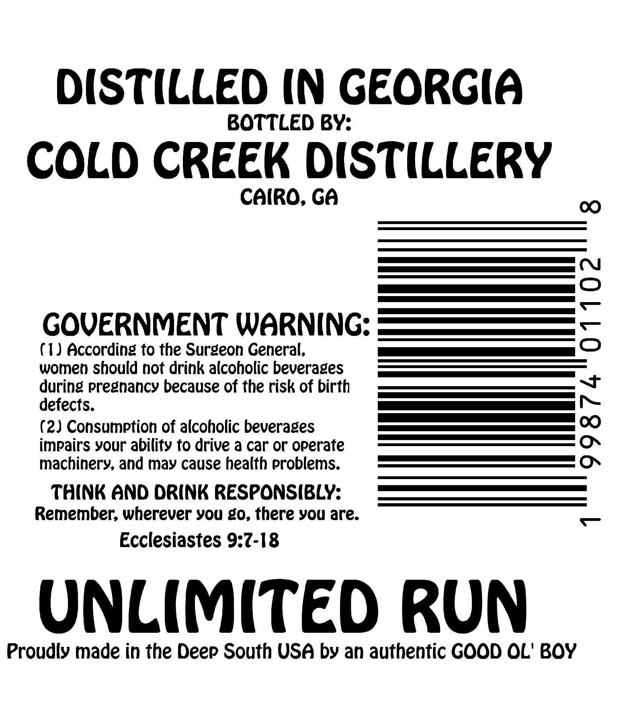

# TTB COLA Label Images - TTBID 26162001000581

**Brand Name:** COLD CREEK DISTILLERY

**Fanciful Name:** TOP SHELF CORN WHISKEY

**Issue Date:** 06/22/2026

**Origin Code:** 08

**Product Class/Type:** 143

**Source:** [TTB Public COLA Registry](https://ttbonline.gov/colasonline/viewColaDetails.do?action=publicFormDisplay&ttbid=26162001000581)

## Label Images

### Front Label

### Label 2

## Extracted Label Text

*Text extracted via OCR - may contain errors*

**Detected Proof:** 90

### Front Label

Cold
Creek
Distillery
#0
Top SHELF CORN WHISKEY
YEEHAA
ALC. 45% BY VOL
90 prooF
PROUDLY DISTILLED AND BOTTLED BY:
COLD CREEK DISTILLERY
CAiRo: Ga
475 ml

### Label 2

DISTILLED (N GeorGiA
BOTTLED BY:
COLD CREEK DISTILLERY
Cairo; Ga
0
GOVERNMENT WARNING:
8
(IJ According to the Surgeon General,
women should not drink alcoholic beverages
during pregnancy because of the risk of birth
detects.
(2) Consumption of alcoholic beverages
2
impairs your ability to drive & car or operate
machinery, and may cause health problems.
THInk AND DRINK RESPONSIBLY:
Remember; wherever vou g0, there you are:
Ecclesiastes 9.7-18
UNLIMITED Run
Proudly made in the Deep South USA by an authentic GOOD OL' BOY
