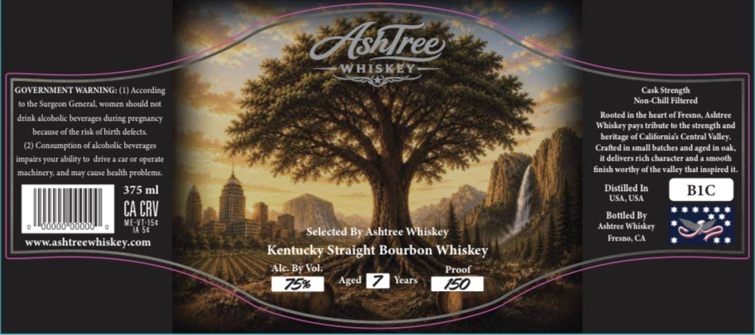

# TTB COLA Label Images - TTBID 26162001000693

**Brand Name:** ASHTREE WHISKEY

**Issue Date:** 06/18/2026

**Origin Code:** 01

**Product Class/Type:** 101

**Source:** [TTB Public COLA Registry](https://ttbonline.gov/colasonline/viewColaDetails.do?action=publicFormDisplay&ttbid=26162001000693)

## Label Images

### Label 1

## Extracted Label Text

*Text extracted via OCR - may contain errors*

### Label 1

Ashlree
WAISKEY
GOVERNMENT WARNING: (L) According
C Strcngth
Surgcon Genetal womich should not
Non-Chill Filtctcd
drink akoholic bcverig s during pregnancy
Rooted =
thc hcart olhrono Ashirce
Whiskcy Pays tribute
the strcngthand
brcausc ofthcrisk ofbinth dckds
hcritegc0f Californixs Ccntral Vallcy.
Consumption ofakoholi brvctages
Cnltedin
ull batchesand agedin 04k.
IMaigtOME
ability
dnte
Opcratc
dcliter ricchurdcrand
amooth
michinctyandmaycausc
hcalth probkcms.
finish Korthy ofthc vallcy that inspired it
375 ml
Distilled In
BIC
UE US
CA CRV
Bottled By
aaol
VEX 5856
Lgningr
Whiskey
Selected ByAshtree Whiskey
hcino
shtreewhiskey com
Kentucky Straight Bourbon Whiskey
Alc Br Vol:
Prool
759
Aged
Sa
150
