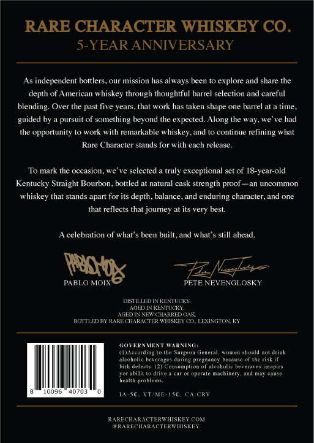
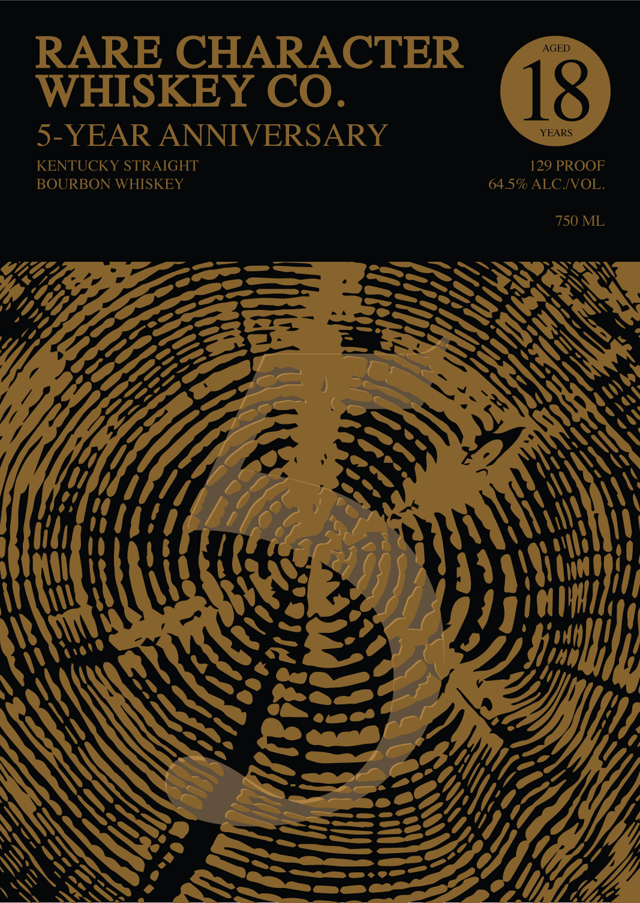

# TTB COLA Label Images - TTBID 26163001000021

**Brand Name:** RARE CHARACTER WHISKEY CO.

**Fanciful Name:** 5 YEAR ANNIVERSARY

**Issue Date:** 07/21/2026

**Origin Code:** 22

**Product Class/Type:** 101

**Source:** [TTB Public COLA Registry](https://ttbonline.gov/colasonline/viewColaDetails.do?action=publicFormDisplay&ttbid=26163001000021)

## Label Images

### Back Label

### Front Label

## Extracted Label Text

*Text extracted via OCR - may contain errors*

**Detected Proof:** 129

### Back Label

RARE CHARACTER WHISKEY CO.
5-YEAR ANNIVERSARY
As independent bottlers
our mission has always been to explore and share the
depth of American whiskey through thoughtful barrel selection and careful
blending
Over the past five years, that work has taken
barrel at a time
pursuit of something beyond the expected
the way
had
the opportunity to work with remarkable whiskey.and
continue refining what
Rare Character stands for with each release_
To mark the occasion,
selected
truly exceptional ser of 18-year-old
Kentucky Straight Bourbon_
bottled
natural cask strength proof
an uncommon
whiskey that stands apart for its depth, balance
and enduring character, and one
that reflects that journey at its very best.
celebralion ol what"
bren buill_ and
hal > slill ahead.
FZNL~
PABLO MOLX
PETE NEVENGLOSKY
DstED
Fenn
AGEDINKETLCR
Feh
NEY CHARREDOAK
KCMTLEUH RARE HARdpR hickE
WTi
WaeepneanaK
Snrcen
Surgeon
Generl
chnula no
drini
alcoholic he"eragcs
Qutlme Wiceuine'
Teciuit
ThcT
di
Lcon umpnon
canonm
petetare
Imadre
Tor #bilit
Imeca
machiner;
Aaamat
heal
WUNenie
10046
407m:
ta
1SC
CRT
RARECHARACTERWHISFEE COM
AaeheeTeceEE
shape
guided
Along
We
Rabk
ding

### Front Label

RARE CHARACTER
AGED
WHISKEY CO.
18
5-YEAR ANNIVERSARY
YEARS
KENTUCKY STRAIGHT
129 PROOF
BOURBON WHISKEY
64.59 ALC JVOL.
750 ML
