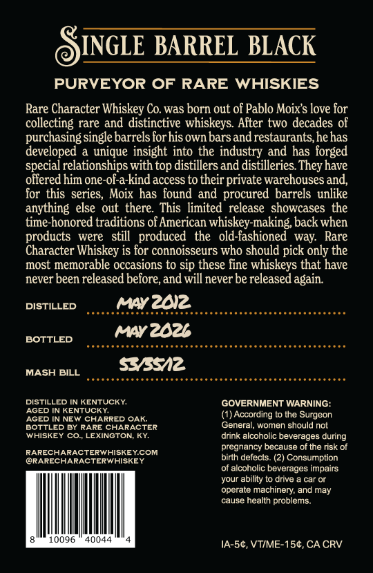
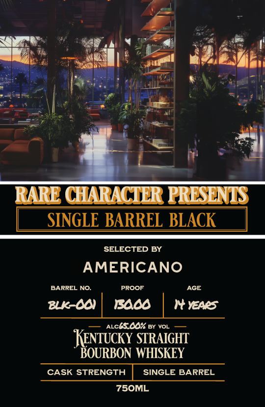

# TTB COLA Label Images - TTBID 26163001000022

**Brand Name:** RARE CHARACTER

**Fanciful Name:** SINGLE BARREL BLACK

**Issue Date:** 07/09/2026

**Origin Code:** 22

**Product Class/Type:** 101

**Source:** [TTB Public COLA Registry](https://ttbonline.gov/colasonline/viewColaDetails.do?action=publicFormDisplay&ttbid=26163001000022)

## Label Images

### Back Label

### Front Label

## Extracted Label Text

*Text extracted via OCR - may contain errors*

### Back Label

INGLE BARREL BLACK
PURVEYOR OF RARE WHISKIES
Rare Character Whiskey Co. was born out of Pablo Moixs love for
collecting rare and distinctive whiskeys. After two decades of
purchasing single barrels forhis own bars
restaurants,hehas
developed a unique insight into the industry and has forged
special relationships with top distillers and distilleries They have
offered him one-of-a-kind access to their private warehouses and,
for this series, Moix has found and procured barrels unlike
anything else out there This limited release showcases the
time-honored traditions of American whiskey-making back when
products
were   still   produced
the
old-fashioned way: Rare
Character Whiskey is for connoisseurs who should pick only the
most memorable occasions to sip these fine whiskeys that have
never been released before,and will never be released again
DISTILLED
mYzdiz
wy2dzb
BOTTLED
MASH BILL
53512
DISTILLED IN KENTUCKY
GOVERNMENT WARNING:
AGED IN KENTUCKY
AGED IN NEW CHARRED OAK
(1) According to the Surgeon
BOTTLED By RARE CHARACTER
General, women should not
WHISKEY CO. LEXINGTON; KY
drink alcoholic beverages during
pregnancy because of the risk of
RARECHARACTERWHISKEYCOM
@RARECHARACTERWHISKEY
birth defects_
Consumption
of alcoholic beverages impairs
your ability
drive
car Or
operate machinery, and may
cause health problems:
0096
Ana4
IA-5c, VTIME-154, CA CRV
and_

### Front Label

RARE CHARACTLR PRLSLNIS
SINGLE BARREL BLACK
SELECTED BY
AMERICANO
BARREL NO:
PROOF
AGE
2k 0
IAd
YEAeS
ALctsc% BY VOL
KEnTucky STRAIGHT
BOURBON WHISKEY
CASK STRENGTH
SINGLE BARREL
75OML
