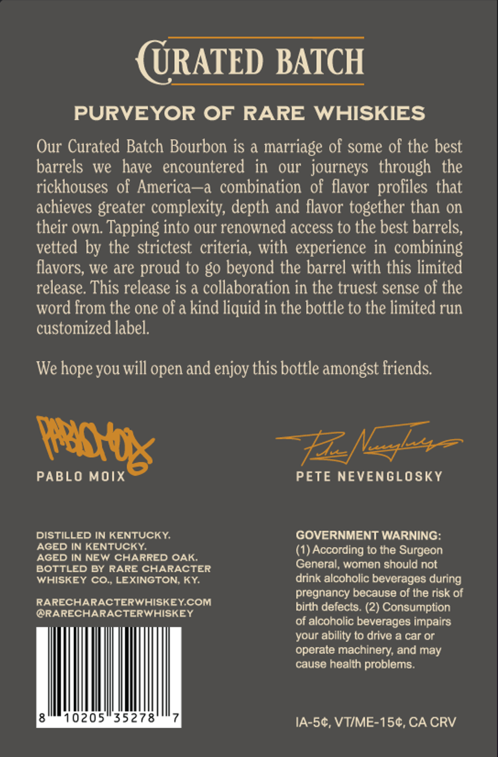
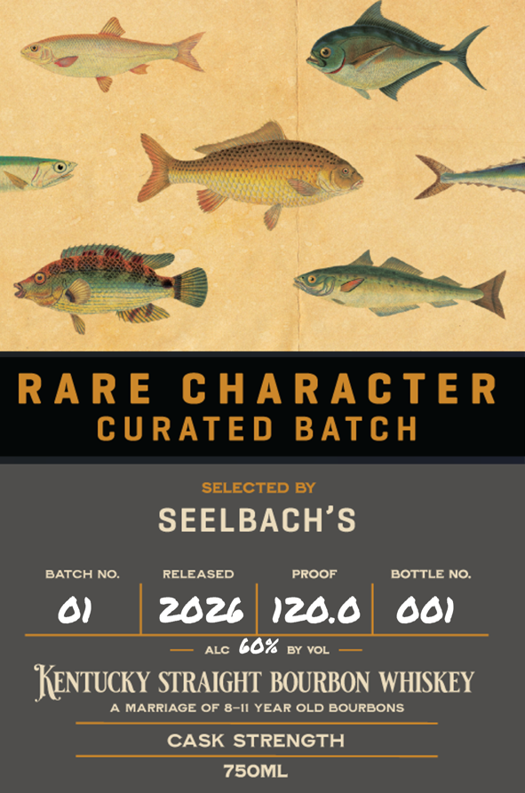

# TTB COLA Label Images - TTBID 26163001000023

**Brand Name:** RARE CHARACTER

**Fanciful Name:** CURATED BATCH

**Issue Date:** 07/09/2026

**Origin Code:** 22

**Product Class/Type:** 101

**Source:** [TTB Public COLA Registry](https://ttbonline.gov/colasonline/viewColaDetails.do?action=publicFormDisplay&ttbid=26163001000023)

## Label Images

### Back Label

### Front Label

## Extracted Label Text

*Text extracted via OCR - may contain errors*

**Detected Proof:** 120

### Back Label

URATED BATCH
PURVEYOR OF RARE WHISKIES
Our Curated Batch Bourbon is
marriage of some of the best
barrels  we
have
encountered
our  journeys   through  the
rickhouses of America
combination of flavor profiles that
achieves greater complexity; depth and flavor together than on
their own: Tapping into our renowned access to the best barrels;
vetted by the strictest criteria, with experience in  combining
flavors;
Ie are
proud to go beyond the barrel with this limited
release. This release is a collaboration in the truest sense of the
word from the one ofa kind liquid in the bottle to the limited run
customized label.
We hope you will open and enjoy this bottle amongst friends:
PABLO Moix
PETE NEVENGLOSKY
DiStIlLed IN KENTUCKY
GOVERNMENT WARNING:
AgED IN KENTUCKY
According
the Surgeon
AGED IN NEW ChaRRED OaK:
BOTTLED By Rare CharACTER
General; womon should not
WhISKEY CoL LEXINGTON Kr
drink alcoholic bevcrages during
pregnancy because ol the risk of
RarECHARACTERWHiSKEYCOM
birth delects: (2) Consumption
@RARECHARACTERWHiSKEY
of alcoholic beverages impairs
your ability t0 drive
car Or
operale machinery: and may
cause health problems
0205
IA-5c, VTIME-150, CA CRV
patg

### Front Label

RARE
C HARAcTE R
CURATE D
BATCH
SELECTED BY
SEELBACH'S
BATCH NO:
RELEASED
PROOF
BOTTLE NO:
01
202b
120.0
001
ALC
60%
BY VOL
Kentucky STRAIGHT BOURBON WHISKEY
MARRIAGE OF 8-I1 YEAR OLD BOURBONS
CASK STRENGTH
75OML
