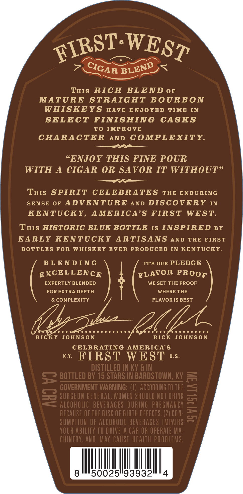
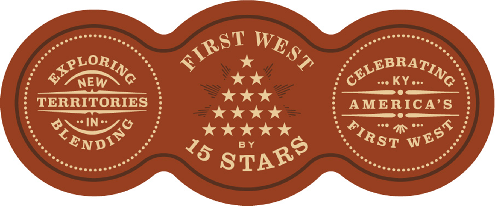

# TTB COLA Label Images - TTBID 26163001000059

**Brand Name:** FIRST WEST

**Issue Date:** 06/22/2026

**Origin Code:** 22

**Product Class/Type:** 121

**Source:** [TTB Public COLA Registry](https://ttbonline.gov/colasonline/viewColaDetails.do?action=publicFormDisplay&ttbid=26163001000059)

## Label Images

### Back Label

### Label 3

## Extracted Label Text

*Text extracted via OCR - may contain errors*

### Back Label

THIS
RICH
BL END 0F
MATURE
STRAIGHT
BOURBON
WHISKEYS
HAVE
ENJOYED
TIME
IN
SELECT
FINISHING
CASKS
To
IMPROVE
CHARACTER
AND
COMPLEXITY
SENJOY THIS FINE POUR
WITH A CIGAR OR SAVOR IT WITHOUT%
THIs SPIRIT
CELEBRATES
THE ENDURING
SENSE
0F
ADVENTURE
AND DISCOVERY
IN
KENTUCKY,
AMERICA'S
FIRST
WEST:
THIs HISTORIC BLUE BOTTLE
IS INSPIRED BY
EARLY KENTUCKY
ARTISANS AND
THE FIRST
BOTTLES FOR
WHISKEY
EVER
PRODUCED
IN KENTUCKY.
B L E N D IN G
IT'S OUR PLEDGE
EXCELLENCE
EXPERTLY BLENDED
WE SET THE PROOF
FOR EXTRA DEPTH
WHERE THE
& COMPLEXITY
FLAVOR IS BEST
{0L2
RICKY
JOHNSON
RICK
JOHNSON
CELBRATING
AMERICA'S
K.Y
FIRST
WEST
U.S.
DISTILLED IN KY & IN
5 BOTTLED BV 16 STARS IN BARDSTOWN, Kv
GOVERNMENT WARNING:
ACCORDING TO THE
8
SURGEOU gehERaL, WOMEU ShOULD HOT DRTK
1
alcoholic  BEVERAGes DURING  pheghahcy
BECAUSE OF THE RISK OF BIRTH dEfECTS: (2) COU-
SUMPTION OF AlCOhOLc BEVERAGES IMPALRS
YOUR AbILITy TO DRIVE A CAR OR OPERATE MA:
CHIHERY, AHD  MAY CAUSe health paObleMS.
8
50025"93932
4
FIRST
WEST
CIGAR
BLEND
FLAVOR
PROOF

### Label 3

NEW
GLEBIATING
KY.
TERRITORIES
AMERICA'S
IN "
RcNd/
BY
FIRST
WEST
ALORING
WEST
FIRST
STARS
15
