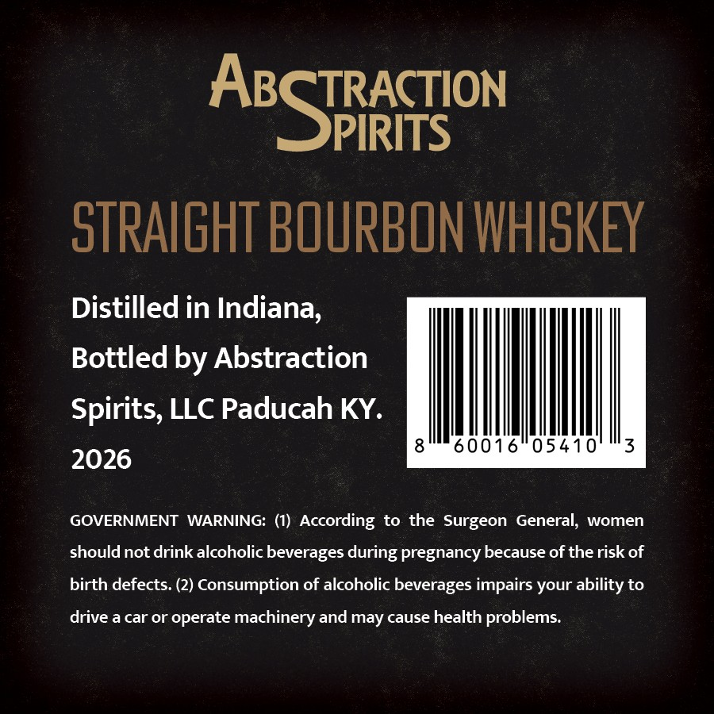
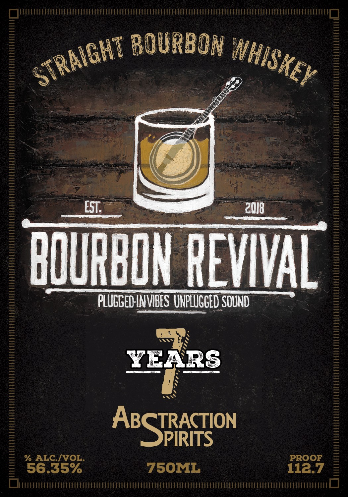

# TTB COLA Label Images - TTBID 26163001000069

**Brand Name:** ABSTRACTION SPIRITS

**Fanciful Name:** BOURBON REVIVAL

**Issue Date:** 06/22/2026

**Origin Code:** 22

**Product Class/Type:** 101

**Source:** [TTB Public COLA Registry](https://ttbonline.gov/colasonline/viewColaDetails.do?action=publicFormDisplay&ttbid=26163001000069)

## Label Images

### Back Label

### Front Label

## Extracted Label Text

*Text extracted via OCR - may contain errors*

**Detected Proof:** 112.7

### Back Label

TRACTION

ABS

PIRITS

oTRAIGHT BOURBON WHISKEY

Distilled in Indiana,

Bottled by Abstraction

Spirits, LLC Paducah KY.

MINIM,

60016 05410

2026

GOVERNMENT WARNING: (1) According to the Surgeon General, women

should not drink alcoholic beverages during pregnancy because of the risk of

birth defects. (2) Consumption of alcoholic beverages impairs your ability to

drive a car or operate machinery and may cause health problems.

### Front Label

BOURBON
EST:
2018
bquRbOL REVVL
PLUCGED INVIBES UNPLUGCED SOUNd
YEARS
AESTRCoN
% ALC.IVOL
PROOF
56.35%
75OML
112.7
STRAIGHT
WHISKEY
