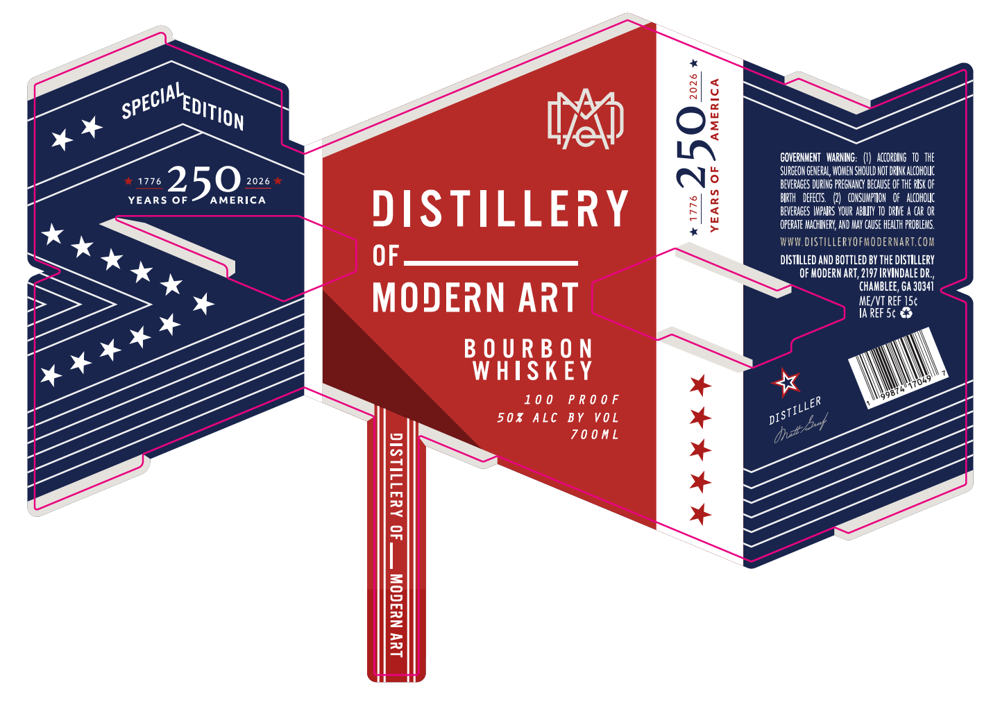

# TTB COLA Label Images - TTBID 26163001000120

**Brand Name:** DISTILLERY OF MODERN ART

**Issue Date:** 06/22/2026

**Origin Code:** 08

**Product Class/Type:** 141

**Source:** [TTB Public COLA Registry](https://ttbonline.gov/colasonline/viewColaDetails.do?action=publicFormDisplay&ttbid=26163001000120)

## Label Images

### Label 1

## Extracted Label Text

*Text extracted via OCR - may contain errors*

### Label 1

25:

YEARS OF

ERICA

GOVERNMENT WARNING: (I) ACCORDING TO. THE
SURGEON GENERAL, WOMEN SHOULD NOT DRINK ALCOHOUC
BEVERAGES DURING PREGNANCY BECAUSE OF THE RISK OF
BIRTH DEFECIS. (2) CONSUMPTION OF ALCOHOLIC
BEVERAGES INPARS YOUR ABIUTY TO DRNE A CAR OR
OPERATE MACHINERY, AND MAY CAUSE HEALTH PROBLEMS.
W.DISTILL RNAR
DISTILLED AND BOTTLED BY THE DISTILLERY
OF MODERN ART, 2197 IRVINDALE DR.,
CHAMBLEE, GA 30341
ME/VT REF 15¢

IAREF 5¢ €%
