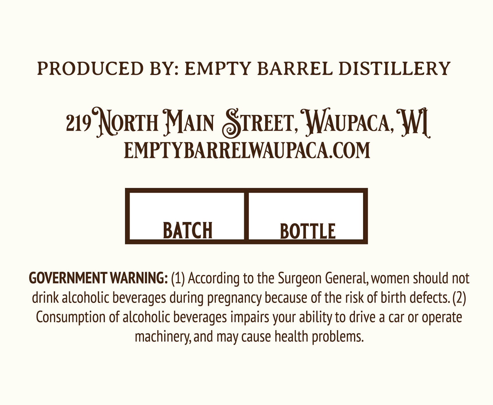
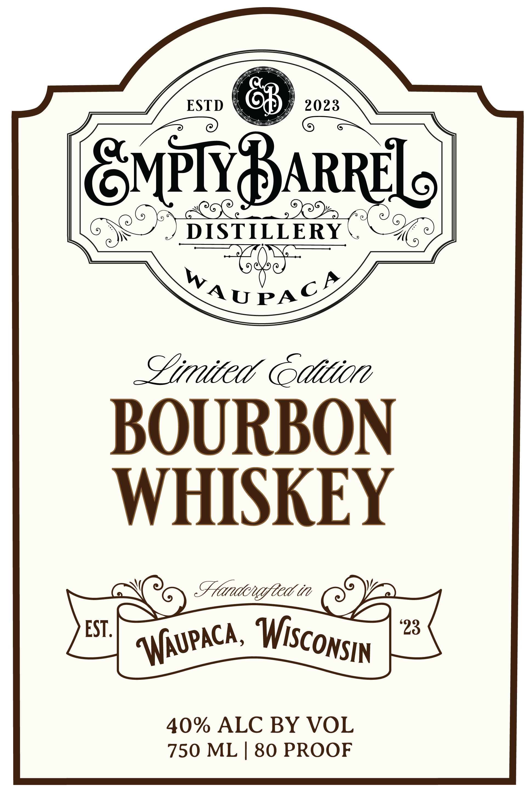

# TTB COLA Label Images - TTBID 26163001000159

**Brand Name:** EMPTY BARREL DISTILLERY

**Issue Date:** 06/25/2026

**Origin Code:** 48

**Product Class/Type:** 141

**Source:** [TTB Public COLA Registry](https://ttbonline.gov/colasonline/viewColaDetails.do?action=publicFormDisplay&ttbid=26163001000159)

## Label Images

### Back Label

### Front Label

## Extracted Label Text

*Text extracted via OCR - may contain errors*

**Detected Proof:** 80

### Back Label

PRODUCED BY: EMPTY BARREL DISTILLERY
219° NORTH MAIN STREET, WAUPACA, WI
EMPTY BARRELWAUPACA.COM
BATCH BOTTLE
GOVERNMENT WARNING: (1) According to the Surgeon General, women should not
drink alcoholic beverages during pregnancy because of the risk of birth defects. (2)
Consumption of alcoholic beverages impairs your ability to drive a car or operate
machinery, and may cause health problems.

### Front Label

ESTD
2023
GMPIBARRE
DISTILLERY
WAUPAc
Zimited Gdition
BOURBON
WHISKEY
Fandcnafteat in
EST .
'23
40% ALC BY VOL
750 ML | 80 PROOF
WiscoNSIN
WUPACa ,
