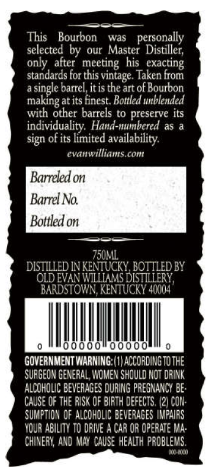
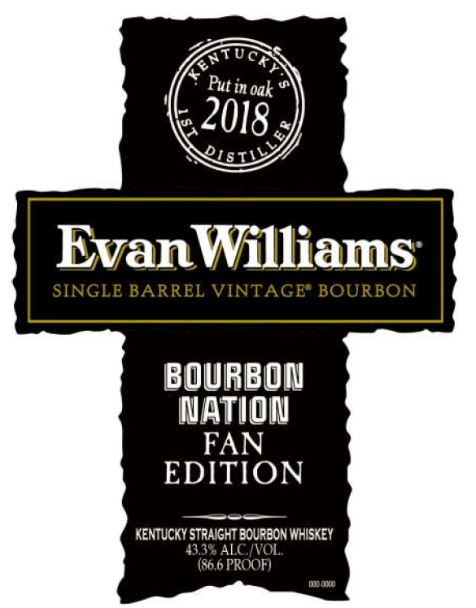

# TTB COLA Label Images - TTBID 26163001000173

**Brand Name:** EVAN WILLIAMS

**Issue Date:** 06/22/2026

**Origin Code:** 22

**Product Class/Type:** 101

**Source:** [TTB Public COLA Registry](https://ttbonline.gov/colasonline/viewColaDetails.do?action=publicFormDisplay&ttbid=26163001000173)

## Label Images

### Back Label

### Label 1

## Extracted Label Text

*Text extracted via OCR - may contain errors*

### Back Label

This
Bourbon
was
personally
selected by
aur
Distillet;
only   after
his
standards for this vintage. Taken from
single barrelitis the
of Bourbon
atits finest_ Bottled unblended
with other barrels to preserve its
individuality Hand-numbered as a
sign of its limited availability:
evanwilliams com
Barreled on
Barrel No:
Bottled on
Z5uml
DISTILLED IN KENTUCKY BOTILED BY
OLD EVAN WiLLIAMS DISTTLLERY,
BARDSTOWN KENTUCKY 40004
0000
00000
GOVERNMENT WARNING; (1} ACCOADING TOthE
SURGEON GEMERAL, WOMEN ShOuLD NOT DRINK
AlcohOLC BEVERAGES DURING PRESNANLY Be:
CAUSE QF tHe RISK €F BIRTH defects. 121 CON:
SUMPTION OF ALCohdLIc BEvERAGES IMPAIAS
VOUR ABILITV TO dRIVE A GAR OR Operate MA;
ChINERY AND MAY cauSe  HEALTH problewS.
Master
meeting
exacting
ane
making

### Label 1

ATucf
Oak
EvanWilliams
SINGLE BARREL VINTAGE" BOURBON
BOuBON
Wation
FAN
EDITION
KENTUCKY STRAIGHT BOURBON WHISKEY
4338 ALC WVOL
(86,6 PROOF)
DLOlO
Put in
2018_
1S
IL_
