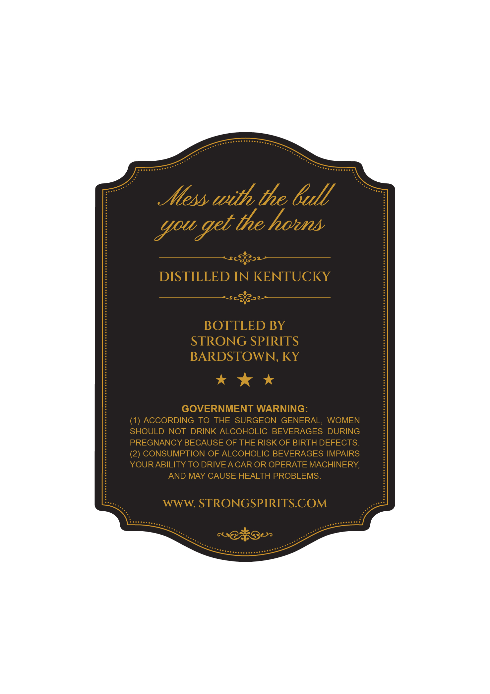
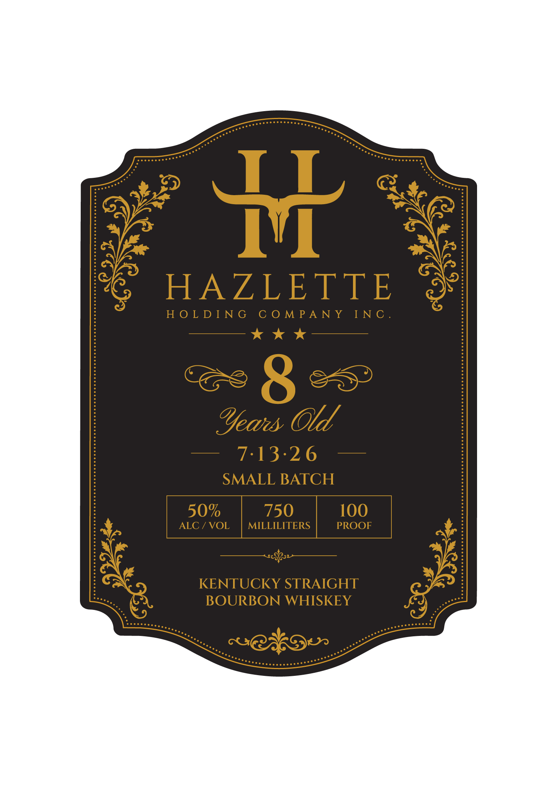
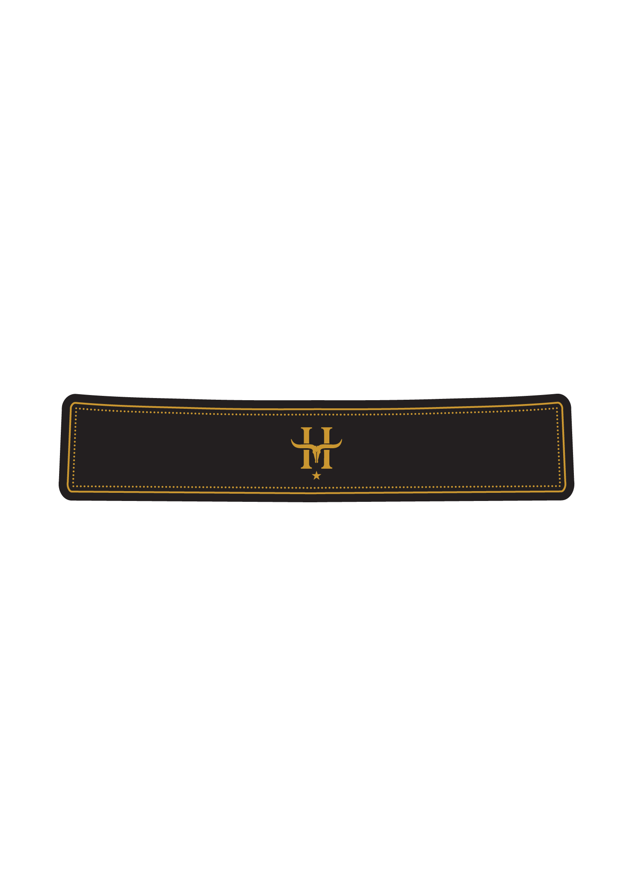
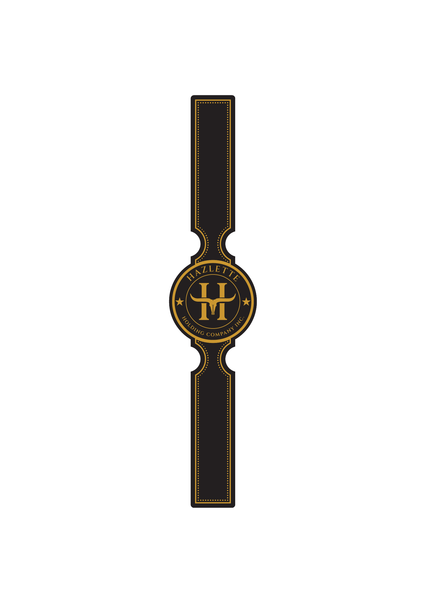

# TTB COLA Label Images - TTBID 26163001000256

**Brand Name:** HAZLETTE HOLDING COMPANY INC

**Fanciful Name:** SMALL BATCH

**Issue Date:** 06/22/2026

**Origin Code:** 22

**Product Class/Type:** 101

**Source:** [TTB Public COLA Registry](https://ttbonline.gov/colasonline/viewColaDetails.do?action=publicFormDisplay&ttbid=26163001000256)

## Label Images

### Back Label

### Front Label

### Label 3

### Label 4

## Extracted Label Text

*Text extracted via OCR - may contain errors*

*2 image(s) excluded: text did not meet readability threshold*

### Back Label

Atess with the Gull
geb the horns
DISTILLED IN KENTUCKY
BOTTLED BY
STRONG SPIRITS
BARDSTOWN, KY
GOVERNMENT WARNING:
ACCORDING TO
THE SURGEON
GENERAL,
WOMEN
SHOULD NOT DRINK ALCOHOLIC
BEVERAGES DURING
PREGNANCY BECAUSE OF THE RISK OF BIRTH DEFECTS.
(2) CONSUMPTION OF ALCOHOLIC BEVERAGES IMPAIRS
YOURABILITY TO DRIVEA CAR OR OPERATE MACHINERY;
AND MAY CAUSE HEALTH PROBLEMS.
wWW: STRONGSPIRITS.COM
GJro
Sou

### Front Label

BRAZLETIE

HOE DEUNG CO MEAN Y¥ SENG:

kk

Years, Old
— 7-13-26 —
SMALL BATCH

KENTUCKY STRAIGHT
BOURBON WHISKEY
