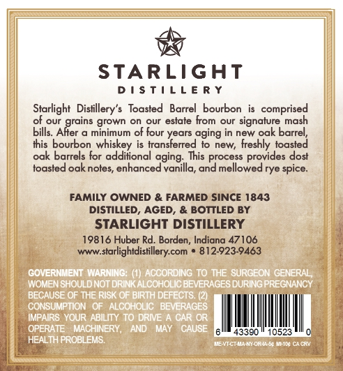
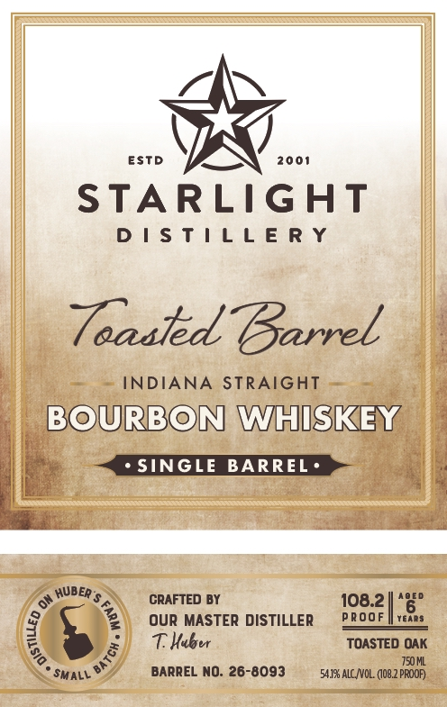

# TTB COLA Label Images - TTBID 26163001000409

**Brand Name:** STARLIGHT DISTILLERY

**Issue Date:** 06/23/2026

**Origin Code:** 19

**Product Class/Type:** 101

**Source:** [TTB Public COLA Registry](https://ttbonline.gov/colasonline/viewColaDetails.do?action=publicFormDisplay&ttbid=26163001000409)

## Label Images

### Back Label

### Front Label

## Extracted Label Text

*Text extracted via OCR - may contain errors*

### Back Label

STARLIGAT
D ! $ T | L L E R Y
Starlight  Distillery's Toasted
Barrel
bourbon
comprised
of our
grown on
our
estate from our signature mash
bills_
"AReains
minimum of four years aging in new oak barrel,
this bourbon whiskey is transferred to
new;
freshly toasted
oak barrels for additional eging;
This process provides dost
toasted oak notes
enhanced
vanilla, and mellowed rye spice:
FAMILY OWNED & FARMED SINCE 1843
DISTILLED_
AGED, & BOTTLED BY
STARLIGHT DISTILLERY
19816 Huber Rd. Borden, Indiana 47106
Www_starlightdistillery com
812923-9463
COVERNMENT WNARNING; () ACCORDING T0 THE SURGEON GENERAL;
WOMENISHOULDNOT DRINKALCOHOLICBEVERAGES DURINGPREGNANGY
BECAUSE OF THE RISK OF BIRTH DEFECTS (2)
CONSUMPTON
ALCCHOLIG
BEVERAGES
IMPAIRS YOUR : ABILITY T0 DRIE
GAR OR
OPERATE
MACHINERY;
AND
MAT
GAUSE
43390
10523
HEALTH PROBLEMS
TnenthtcNYoe4n
Cace

### Front Label

ESTd
2001
STARLIGHT
D | $ T | L L E R Y
Taaaled Barrel
INDIANA
STRAIGHT
BOURBON WHISKEY
SINGLE
BARREL '
04 HUbeR $
CRAFTED BY
108.2
ADED
OuR MASTER DISTILLER
PRooF
Tears
THueer
TOASTED OAK
750 ML
SmaLL
BARREL NO: 26-8093
54.138 ALC NOL. (08.2 PROOP
1
1
3
