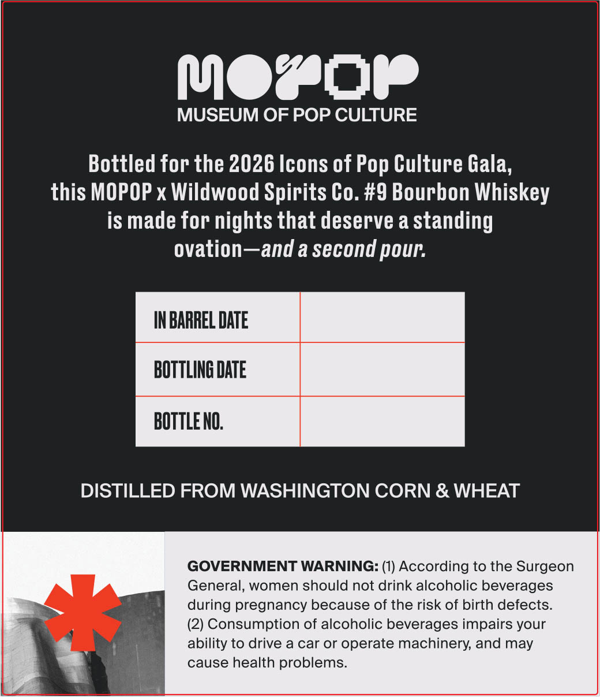
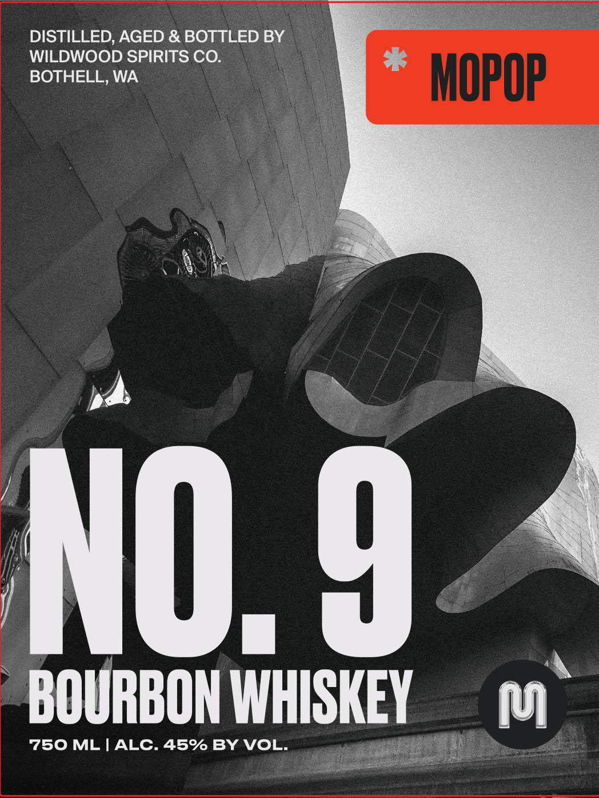

# TTB COLA Label Images - TTBID 26163001000470

**Brand Name:** MOPOP BARREL NO. 9

**Fanciful Name:** MOPOP BARREL NO. 9

**Issue Date:** 07/13/2026

**Origin Code:** 07

**Product Class/Type:** 141

**Source:** [TTB Public COLA Registry](https://ttbonline.gov/colasonline/viewColaDetails.do?action=publicFormDisplay&ttbid=26163001000470)

## Label Images

### Back Label

### Front Label

## Extracted Label Text

*Text extracted via OCR - may contain errors*

### Back Label

MozOp
MUSEUM OF POP CULTURE
Bottled for the 2026 Icons of
Culture Gala;
this MOPOP x Wildwood Spirits Co. #9 Bourbon Whiskey
is made for nights that deserve a standing
ovation ~and a second pour:
IN BARREL DATE
BOTTLING DATE
BOTTLE NO.
DISTILLED FROM WASHINGTON CORN & WHEAT
GOVERNMENT WARNING: (1) According to the Surgeon
General, women should not drink alcoholic beverages
during pregnancy because of the risk of birth defects:
(2) Consumption of alcoholic beverages impairs your
ability to drive a car or operate machinery; and may
cause health problems
Pop

### Front Label

DISTILLED, AGED & BOTTLED BY
WILDWOOD SPIRITS CO.
BOTHELL, WA
MOpOP
U
NO. 9
BOURBON WHISKEY
p
750 ML
ALC.45% BY VOL
