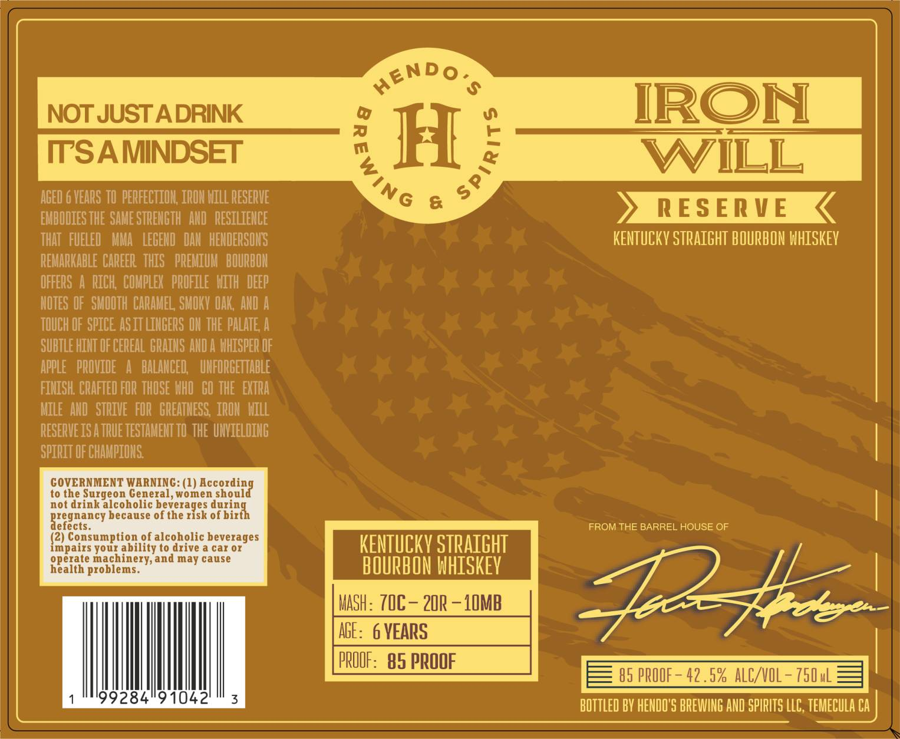

# TTB COLA Label Images - TTBID 26163001000474

**Brand Name:** HENDO'S BREWING AND SPIRITS LLC

**Issue Date:** 06/22/2026

**Origin Code:** 01

**Product Class/Type:** 101

**Source:** [TTB Public COLA Registry](https://ttbonline.gov/colasonline/viewColaDetails.do?action=publicFormDisplay&ttbid=26163001000474)

## Label Images

### Label 1

### Label 2

## Extracted Label Text

*Text extracted via OCR - may contain errors*

*1 image(s) excluded: text did not meet readability threshold*

**Detected Proof:** 85

### Label 1

S
NOT JUST ADRINK
IRON
TTSAMINDSET
H
WILL
AGED 6 VEARS TO PERFECTION; IRON Mill RESERVE
&
EMbOdiES THE SAME STRENGTH ; AND  RESILIENCE
RESER V E
THAT   FUELED   MMA  LEGEND  DAN   HENDERSONS
KENTUCKV StrAighT BOURBON WHISKEV
REMARKABLE CAREER  thiS   PREMIUM   BOURbOM
OFFERS
RICh  COMpLeX   profile   WiTh  deep
MoteS OF   SMOOTH  CARAMEL; SMOKV OAk , AND
TOUCH OF SPICE Asit LINGERS ON THE PALATE A
SubTLE HiNT OF CEREAL  GRAINS AND A WhiSpER OF
AppLE   PROVIDE
A   BALANCEL   uhfORcETTable
FiNISH; CRAFTEd FOR THOSE WHO   GO THE   EXTRa
MILE AND   STRIVE   FOR   GREATNeSS   IRON hill
RESERVEISA TRUE TESTAMEHT TO THE UIIELDING
spirit OF CHAMPIONS
COVERNMENT WARNING: (1)
lescedin{
to the Surgeon Ceneral, women
not drink alcoholic
ONteeaSk 8HEiX
because of the
Reeectancy
FROM THE BARREL HOUSE OF
(2) Consumption of alcoholic beverages
impairs your ability t0 drive a car 0r
KENTUCKV StRAiGht
machinery;and may cause
Realdk  roiieine
BOURBON whiSkey
MaSh: TIC - 20R
LOMB
3245
AGE:  6 VEARS
PROOF:   85 PROOF
85 PROOF
42 .5% ALC/VOL
750uL
99284"91042
3
BOTTLEd BV HENDO'S BREWING AND SPIRITS LLC,teMECuLA CA
Aendo.
(
)
