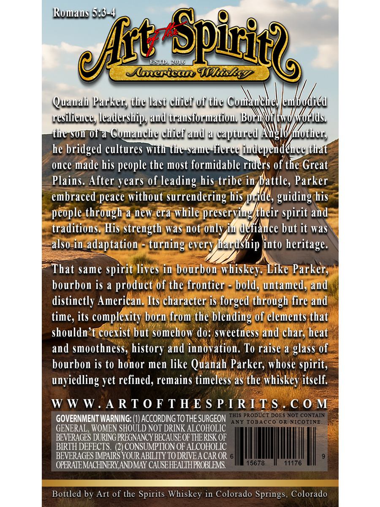
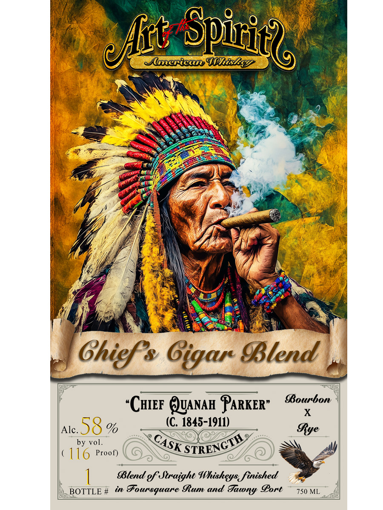

# TTB COLA Label Images - TTBID 26163001000506

**Brand Name:** ART OF THE SPIRITS AMERICAN WHISKEY

**Fanciful Name:** CHIEF QUANAH PARKER

**Issue Date:** 07/09/2026

**Origin Code:** 13

**Product Class/Type:** 139

**Source:** [TTB Public COLA Registry](https://ttbonline.gov/colasonline/viewColaDetails.do?action=publicFormDisplay&ttbid=26163001000506)

## Label Images

### Back Label

### Front Label

## Extracted Label Text

*Text extracted via OCR - may contain errors*

**Detected Proof:** 116

### Back Label

Romaus 5;8-4,
ESjn
20lo
Mlmerica Whiskey
Quauah Parker, the last chiei 0i the Comaulkey /eudbadicd
resilieuce, leaderships aud trausiormatiou: BoryNuz kwdKokids
thc B0n 0f a Comauche chief aud a captured AH
Krother ,
he bridged cultures withc tht-Same-lierce iudependehce that
once made his people the most formidable riders of the Great
Plains. After years of leading his tribe in battle, Parker
embraced peace without surrendering his pride, guiding his
people through a new era while preserviugkheir spirit and
traditions. His strength was
onlyiu defiauce but it was
also in adaptation - turning every KardShip into heritage.
That same spirit lives in bourbon whiskey: Like Parker,
bourbon is a
product of the frontier
bold, untamed, and
distinctly American. Its character is forged through fire aud
time, its complexity born from the blending of elemeuts that
shouldn't coexist but somehow do: sweetuess and char; heat
and smoothness, history and innovation: To raise a glass of
bourbon is to honor men like Quanah Parker; whose spirit,
unyiedling yet refined, remains timeless as the whiskey itself:
W W W
A R T 0 F T HE S P IRTTS .
C 0 M
GOVERNMENT WARNING: (1) ACCORDING TO THE SURGEON TAIS/PROBUC CoooR NOICOONMEN
ANY TOBACCO OR NICOTINE
GENERAL , WOMEN SHOULD NOT DRINK ALCOHOLIC
BEVERAGES DURING PREGNANCY BECAUSE OF THERISK OF
BRRTH DEFECTS.
CONSUMPTION OF ALCOHOLIC
BEVERAGES IMPAIRS YOUR ABLLITY TO DRIVEA CAR OR
OPERATEMACHINERYANDMAY CAUSEHEALTHPROBLEMS
15678
11176
Bottled by Art of the Spirits Whiskey in Colorado Springs, Colorado
{Spiticr
elt
not

### Front Label

Spiric
Auerican MhisEay
Ghief& Gigar BBlend
Bourbon
CHIEF QUANAH PARKER"
X
Alc.
58 %
(C. 1845-1911)
Iye
by vol_
116 Proof)
Blend ef traight Whiskeys finished
BOTTLE #
in
Ffoursquare Ium and
Sort
750 ML
@ft
CASK
STRENCTH
Jawny
