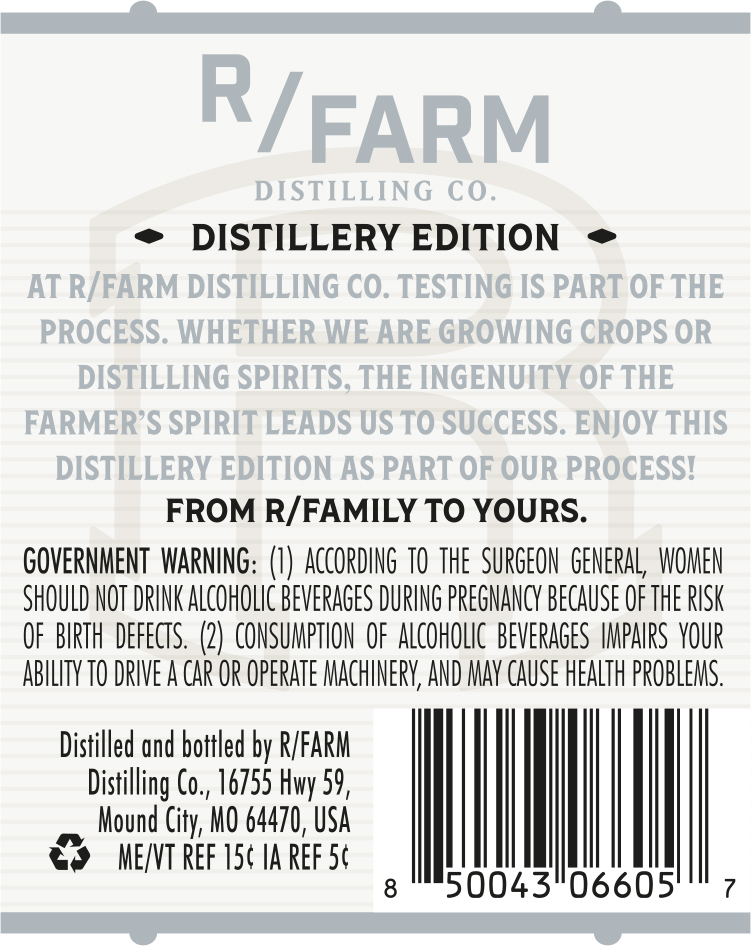
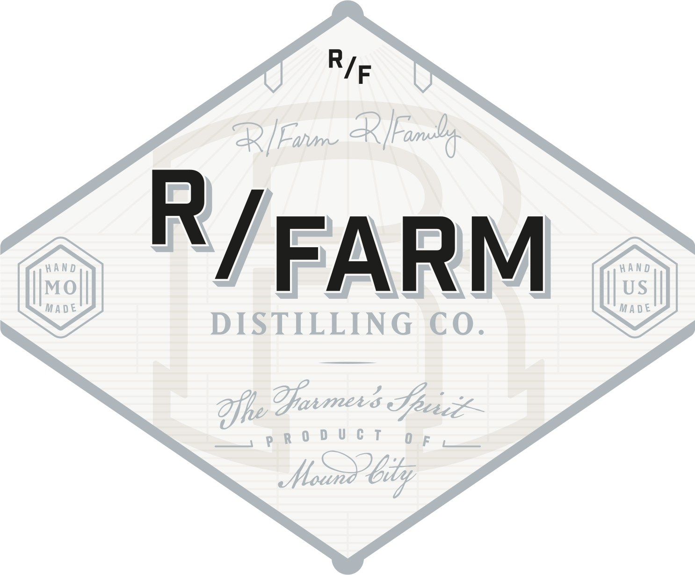
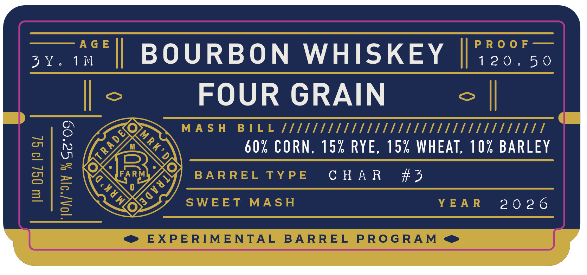

# TTB COLA Label Images - TTBID 26163001000585

**Brand Name:** R/FARM DISTILLING CO.

**Issue Date:** 06/23/2026

**Origin Code:** 29

**Product Class/Type:** 141

**Source:** [TTB Public COLA Registry](https://ttbonline.gov/colasonline/viewColaDetails.do?action=publicFormDisplay&ttbid=26163001000585)

## Label Images

### Back Label

### Front Label

### Label 3

### Label 4

## Extracted Label Text

*Text extracted via OCR - may contain errors*

*3 image(s) excluded: text did not meet readability threshold*

### Back Label

R
FARM
DISTILLING CO.
DISTILLERY EDITION
AT R/FARM DISTILLING CO. TESTING IS PART OF THE
PROCESS. WHETHER WE ARE GROWING CROPS OR
DISTILLING SPIRITS; THE INGENUITY OF THE
FARMER S SPIRIT LEADS US TO SUCCESS. ENJOY THIS
DISTILLERY EDITION AS PART OF OUR PROCESSI
FROM R/FAMILY TO YOURS:
GOVERNMENT  WARNING: (U) according TO the  SURGEON  GENERAL   WOMEN
SHOULD NOT DRINK ALCOHOLIc BEVERAGES DURING PREGNANCY BECAUSE OF THE RISK
OF BIRTH  defects. (2) CONSUMPTHON  OF ALcOHOLC  BeVERAGES  IMPAIRS VOUR
abILTY TO DRIVE a car OR OPERATE MACHINERV, AND MAY CAUSE HEALTh PROBLEMS.
Distilled ond bottled by R/FARM
Distilling Co, 16755
59 ,
Mound City; MO 64470, USA
MEYVT Ref 15c Ia ReF 5c
8
50043"06605'
Hwy
